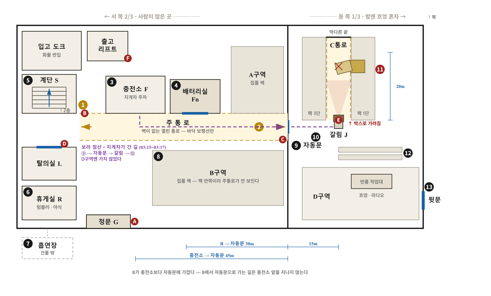

# 「야간조」 — 시나리오 작업 문서

> **상태** 초안 v1.2 · 2026-09-15
> **구성** 피해자 1 + 용의자 6
> **부제 후보** 「무재해 1,247일」 · 「대신 찍어 드릴게요」 · 「C구역」
>
> 이 문서는 **각색용 작업본**입니다. 정본(`src/data/gameData.js`)으로 옮기기 전 단계이며,
> 사용자가 고친 내용을 이 파일에 얹고 그 diff 를 따라갑니다.

---

## 0. 한눈에

| | |
|---|---|
| **피해자** | 박태식(47) · 심야조 조장 — 스트레치 랩 질식 |
| **직접 범인** | 서장현(38) · 안전관리자 |
| **별개 범행** | 차민우 · 오정숙 · 흐엉 · 윤도경 — 서로 몰랐고 진범과도 공모하지 않았다 |
| **무고** | 임기석(52) — 완전 무고이나 자기를 의심한다 |
| **숨은 관계** | 오정숙 ↔ 임기석 옛 부부 (아들 준호 17) |
| **사건 시각** | 03:05 가격 → 03:08~12 질식 → 03:17 사고 위장 |
| **최초 신고** | 04:15 (발견 04:10) — 신고자는 서장현 |

**한 줄** — 그날 밤 다섯 명이 각자 다른 이유로 구멍을 하나씩 뚫었고, 여섯 번째가 그 다섯 개를 전부 쓰고도 남이 만들어 준 줄 몰랐다.

---

## 1. 무대

### 1-1. GH로지스 3센터

경기 외곽. 3PL 물류센터. 성수기 물량 정점 주의 **심야조(23:00~08:00, 야식 03:30~04:00)**.
창문이 없고, 라디오가 밤새 나오고, 사람이 늘 모자란다.
정직원은 셋(조장·안전관리자·지게차 기사)뿐이고 나머지 스물둘은 계약·파트·알바·이주노동자다.

**사람이 모자라서 서로 대신 출퇴근 카드를 찍어 주는 것이 관행이 되었다.**
조장은 알면서 눈감아 줬고, 눈감아 준 만큼 여섯 명 전부의 약점을 쥐게 됐다.

**이 센터는 느슨하다.** 사무실 문을 잠그지 않고, 태블릿에 잠금이 없고, 열쇠함 열쇠는 열쇠함 위에 있고, 뒷문에는 고임돌이 끼워져 있다. 이 느슨함이 다섯 개의 구멍을 가능하게 한다 — 그리고 그 느슨함을 15년 동안 만든 사람이 조장이다.

### 1-2. 구조 — 전체 그림

> **평면도** — [`평면도.html`](야간조-자료/평면도.html) 을 브라우저로 열면 도면 아래에 번호별 설명이 함께 나옵니다.
> 곁들여 [`평면도-gemini.png`](야간조-자료/평면도-gemini.png) 는 분위기용입니다.
>
> 


```
        ← ─────────  서쪽 2/3 (80m)  ───────── →  │  ← 동쪽 1/3 (40m) → ↑북
  ┌──────────────────────────────────────────────┼──────────────────────┐
  │ [입고도크]        [출고리프트]               │      ┌──────────┐    │
  │      │      ┌────────────┐  ┌───────┐        │      │  C통로    │    │
  │      │      │  충전소 F   │  │ A구역  │       │      │ (북 40m)  │    │
  │      │      │ [배터리실Fn]│  └───────┘       │      │  랙 3단   │    │
  │      │      └────────────┘  ┌───────┐        │      │   ▓ Cx ▓  │    │
  │  ═══════(M-1)═══ 주 통 로 ═══│ B구역  │═════[M2]════╡          │    │
  │      │                      └───────┘  자동문 └────┬─────┘    │
  │  [계단S]                                     │      [ J ]  │          │
  │  [탈의실L]                                   │      갈림   │          │
  │  [휴게실R]                                   │        │            │
  │      │                                       │      ┌─┴────────┐    │
  │  [정문G]                                     │      │  D구역    │    │
  └──────┼───────────────────────────────────────┼──────│  반품     │─┐  │
      [흡연장SM]                                 │      └──────────┘ │  │
                                                 │              [뒷문BD]│
                                                 └─────────────────────┘
  2층 — 계단(S)으로만 오른다: 포장 라인 · 출고 도크 · 사무실 · 관제실
       (화물은 출고 리프트로 올라간다 — 사람은 못 탄다)

  카메라 여섯 — G-1 정문(얼굴) · M-1 주통로서 · M-2 자동문 · L-1 탈의실입구
                C-3 갈림(00:30~04:11 가려짐) · 출고리프트 하단
```

**★ 동서를 오가는 길은 자동문(M2) 하나다.** 화재 방연 셔터를 겸한 문이라 다른 통로가 없다.
자동문은 **주통로 동쪽 끝 ↔ 갈림(J)** 사이에 있다. 문을 지나면 15m 앞이 갈림이고, 갈림에서 **북쪽이 C통로, 남쪽이 D구역**이다.

| 영역 | 무엇이 붙어 있나 |
|---|---|
| **정문 G** | 흡연장(쪽문 밖) · 휴게실 · 주통로 서쪽 끝 |
| **휴게실 R** | 정문 · 탈의실(10m) · **계단 S**(15m) · 주통로 |
| **계단 S** | 1층 휴게실 옆 ↔ **2층 사무실·관제실·포장·출고 도크** (2층으로 가는 유일한 길) |
| **주통로** | A구역 · B구역 · **충전소 F**(동쪽 끝) · 자동문 M2 |
| **충전소 F** | 주통로 동쪽 끝. **바로 뒤가 배터리실**(문이 주통로를 향한다) |
| **자동문 M2** | 주통로 동쪽 끝 ↔ 갈림 J. **동서 유일 통로** |
| **갈림 J** | 자동문(서 15m) · **C통로(북)** · **D구역(남)**. C-3 카메라가 여기 |
| **C통로** | 갈림에서 북쪽 **25m** 막다른 통로. 현장 Cx는 입구에서 20m 안. **출구는 갈림 하나** |
| **D구역** | 갈림에서 남쪽. 반품 작업대(J에서 15m) · **뒷문 BD**(작업대에서 40m, 동쪽 끝) |
| **뒷문 BD** | D구역 동쪽 끝 → **바깥 주차장**. 들어오면 D 작업대 옆을 지나 갈림으로 나와야 한다 |


> **C구역이 현장인 이유 셋**
> ① 장척·대형 화물이라 파렛트 하나가 200kg 넘음 — **파렛트 사고가 자연스러운 유일한 구역**
> ② 집품 인원이 배정되지 않는 밤이 많음. 그날이 그런 밤. 동쪽 1/3에는 **흐엉 한 사람**(D구역 반품 분류)만 있었다
> ③ **카메라가 하나뿐**

**C구역은 「현장」이고 「무대」가 아니다.** 주 무대는 휴게실 · 탈의실 · 2층 사무실 · 흡연장 · 자동문 앞이다.

**★ 순찰 주기** — **조장은 매 정시 출발**(00·01·02·03·04시), **1층 A·B → 계단 → 2층** 순으로 한 바퀴 30분. 안전관리자는 그 사이 30분대에 나간다. 일지는 2층 사무실 클립보드 한 권에 둘이 나눠 적고, **1층 칸과 2층 칸이 따로** 있다.

**그날 밤 02:00 순찰이 반만 적혀 있다.** 조장은 02:05에 텀블러를 마시고 02:10에 나갔는데, 02:35쯤 약이 돌기 시작해 A·B를 겨우 돌고 **휴게실 의자에 주저앉았다.** 2층은 올라가지 못했다 — **일지의 02:00 2층 칸이 비어 있다.**

**그리고 그 모습을 여러 사람이 봤다.** 02:40 전후로 B구역에서 화장실·정수기를 오가던 **오정숙과 윤도경**이 휴게실 의자에 기대 눈을 감고 있는 조장을 본다. 15년 동안 순찰 중에 앉아 있는 걸 본 적이 없는 사람들이다. 둘 다 이상하다고 생각하고, 둘 다 말을 걸지 않는다 — **오늘 밤은 그에게 불려가고 싶지 않은 밤이니까.** 이 목격이 03:30 야식 자리에서 한 번 더 나온다(§8-6).

**야간 순찰은 서쪽 2/3만 돈다** — 조장도 서장현도 A·B·2층을 돈다. 동쪽(C·D)은 「C-3 카메라와 지게차 기사가 대신 본다」는 것이 15년째 관행이다. 그래서 조장·서장현의 순찰이 M-2 자동문 기록에 없다(§9-1) — 그날 밤 동쪽에 정기적으로 드나든 것은 흐엉과 지게차뿐이었다.

### 1-3. ★ C-3 카메라 — 이 하나가 판을 만든다

**C-3 카메라는 C통로 전체와 D구역 입구를 함께 담당한다.** C/D 갈림(J)의 랙 기둥 2.4m 높이에 붙어 있고, 그 앞 1단 빔(1.2m)을 딛으면 손이 닿는다.

오정숙은 **자기 D구역 절도를 가리려고** 그 렌즈에 박스를 얹었다.
그 렌즈에 C통로가 같이 들어 있는 줄 몰랐다.
**그녀는 자기가 C통로를 통째로 지웠다는 것을 모른다.**

**★ 서장현이 몰랐던 것** — **CCTV는 본사 보안업체 위탁이라 센터 안전관리자의 점검 항목이 아니다**(순찰 일지 양식에 CCTV 칸이 없다). 그래서 화각이 언제 바뀌었는지 그는 알 길이 없었다. C-3은 원래 D구역 반품 절도를 잡으려고 단 카메라였다. 화각이 나중에(랙 재배치 공사 때) C통로까지 넓어졌는데, 그 갱신을 아는 사람은 관제실 담당자와 설비팀뿐이다. 안전관리자인 그는 옛 설치 목적대로 **「D구역용, C는 사각」**으로 알고 있었다 — 그래서 C를 «카메라 없는 통로»로 골랐다. 그가 「운이 좋았다」고 믿는 것은 이 오해 위에 서 있다. 조사 중 「검은 화면」이라는 말을 듣고서야, 자기가 하마터면 찍힐 뻔했다는 것을 처음 안다.

### 1-4. CCTV 가 말해 주는 범위 (규칙으로 못박을 것)

> **이 센터의 카메라는 보험료와 화물 분실 때문에 달렸다** — 사람을 감시하려고 단 것이 아니라 **물건과 사고**를 보려고 단 것이다. 그래서 **어디에 어떤 각도로 달렸는지가 무엇까지 찍히는지를 정한다**(§15-4).
> **정문(G-1)만 얼굴이 식별된다** — 출입 통제용이라 눈높이에서 정면을 보기 때문이다.
> 나머지는 「몇 시에 · 몇이(사람인지 지게차인지) · 어느 방향으로」까지다. 특히 **자동문(M-2)은 문 위에서 수직으로 내려다보는 통행 계수용**이라 **원리상 얼굴이 안 찍힌다** — 위에서 보면 안전모와 어깨뿐이다.

새벽이슬의 「판이 알려 주는 것은 번호와 시각까지」와 같은 원칙이다.

### 1-5. ★ 기록이 두 벌이다 — 이 게임의 엔진

| | 무엇 | 어디에 | 지울 수 있나 |
|---|---|---|---|
| **게이트 태그** | 사원증을 정문 리더기에 찍은 시각 | **본사 서버** | 못 지운다 |
| **집품 단말 기록** | 단말(PDA)로 물건을 스캔할 때마다 찍히는 사번 + 선반번호 + 시각 | **본사 서버** | 못 지운다 |
| 자재 반출 서류 | 비품·자재 반출 전표 — **이번 분기(6~9월) 처리분만 태블릿에 올라와 있다** | 센터 태블릿 | **취소 처리는 된다** |

**집품 단말 기록이 뭔가** — 작업자가 단말에 자기 사번으로 로그인 → 시스템이 「C-14-3번 선반, 상품 A, 2개」를 지시 → 그 자리로 가서 **선반 바코드 스캔 → 상품 바코드 스캔 → 수량 입력** → 다음 지시. 스캔 한 번마다 `사번 | 단말번호 | 선반 | 상품 | 수량 | 시각(초 단위)` 이 찍힌다.

**남의 사번으로 대신 찍는 것은 얼마든지 된다.** 단말 두 대를 들면 두 사람 몫이 찍힌다.
그래서 전수 점검이 잡는 것은 「없었다」가 아니라 **「한 사람이 두 대를 들었다」는 무늬**다.

- 두 사번이 **같은 선반에서 3~5초 간격으로 번갈아** 찍힌다 (한 손에 하나씩)
- 반대로 두 사번이 1분 안에 30m 떨어진 곳에서 찍히면 그건 진짜 두 사람이다
- 한 사람이 두 몫을 하니 **둘 다 시간당 처리량이 평소의 60%**로 떨어진다

**차민우의 경우** — 시험 기간 나흘 동안 그의 사번은 계속 오정숙과 같은 선반에서만 찍혔고 둘 다 처리량이 반토막이다. 대조하면 한 줄에 드러난다.

**★ 관리자 조회는 따로 인증이 필요하다** — 태블릿 화면 자체는 잠금 없이 열려 있어도, **「관리자 조회」**(전표 취소·이력 보기)는 사번+비밀번호 재인증을 요구하고, 그 계정·단말·시각이 로그에 남는다. 02:50 박태식이 자기 이름으로 취소된 전표 3건을 발견한 것도, 03:24 서장현이 그 취소 이력을 본 것도 이 조회다 — **둘 다 로그에 남는다.** (§10 물증)

---

## 2. 전수 점검 — 누가, 왜, 어떻게

### 2-1. 지시 계통

- **주최** — 본사 인사팀. 안전 감사에 딸린 부속 절차로 공문이 내려왔다
- **지시** — 센터장 → 각 조 조장에게 **자체 점검 후 보고**
- **실무** — 각 조 조장 본인. 심야조는 **박태식**

**박태식 말고는 심야조 점검을 할 사람이 없다.** 조회 권한이 조장 계정에 걸려 있고, 무엇보다 **누가 누구 카드를 찍어 줬는지 아는 사람이 그뿐**이다. 그가 못 움직이면 심야조 점검은 통째로 멈춘다.

### 2-2. ★ 조장은 잡으려던 게 아니라 덮으려던 것이다

기록은 본사 서버라 못 지운다. 그가 쥔 건 다른 것이다 — **자체 점검 보고서를 쓰는 사람이 그이므로, 이상 건마다 사유를 붙이는 권한이 그에게 있다.**

> 「6/12 단말 2대 동시 로그인 — **배터리 교체로 단말 재배정, 정상**」
> 「7/03 게이트 기록 누락 3건 — **리더기 오류, 설비팀 점검 완료**」
> 「9/18 처리량 저하 — **신규 선반 재배치 기간**」

본사는 백 개 센터의 보고서를 받아 **소명이 붙은 건은 종결**한다.
그래서 그에게 필요한 건 **누가 언제 왜 대리했는지 정확히 아는 것**이고, **수첩이 그 밑자료**다.

**「한 명씩 부른다」도 같은 논리다.** 그가 개별로 사람을 불러 사정을 듣는 것은 자백을 받으려는 것이 아니라 — **소명거리를 함께 만들려는 것**이다. 조용히 개별로 부르는 것이 오히려 「누가 먼저 불려가나」로 눈길을 끌기 쉽고, 공개 고지는 **사유를 준비할 시간**을 다 함께 주는 셈이라 그의 방식과 맞는다.

### 2-3. 22:40 조회 — 그가 한 말과 사람들이 들은 말

> 그가 한 말 — *"다음 주에 본사 감사 나옵니다. 근태 기록도 같이 전수로 봐요. 기록에 걸릴 만한 거 있는 사람은 **오늘 밤부터 하나씩 나한테 와서 얘기하세요. 내가 정리해서 올립니다.**"*
> 사람들이 들은 말 — *"오늘 밤부터 하나씩 불려간다."*

**★ 이 대사가 하는 일 셋** — 이 문장은 장식이 아니라 세 개의 장치다.

1. **조장의 의도를 대사 하나로 보여 준다.** 「나한테 와서 얘기하라, 내가 정리한다」는 **소명을 대신 써 주겠다**는 뜻이다(§2-2). 그가 잡으려는 게 아니라 덮으려 한다는 걸, 설명 없이 대사로 드러낸다.
2. **차민우에게 타이머를 건다.** 「오늘 밤부터」가 없으면 그가 왜 하필 오늘 약을 타는지 설명되지 않는다. 그가 두려운 건 불려가는 것 자체가 아니라 — **오정숙과 말을 맞추기 전에 불려가는 것**이다.
3. **「본사 감사」라는 낱말이 임기석을 건드린다.** 그에게 근태 점검은 남의 일이지만, 본사 감사는 다르다(§6-6).

**그리고 이 오해가 판 전체의 원동력이다** — 조장은 「와서 얘기해라」라고 했고, 여섯은 「불려간다」로 들었다.

**이 오해가 그날 밤 다섯 개의 구멍을 전부 뚫은 것은 아니다.** 그가 이 40분 안에 실제로 한 일은 셋 — 22:45 흐엉에게 여권 반환 예고, 22:50 윤도경에게 전환 보류 통보, 23:20 서장현에게 보고서 책임 전가. 이것이 §4의 「살아남을 순서」다. 나머지 구멍은 각자 다른 자리에서 갈라져 나온다 — 오정숙은 부풀려진 소문(「CCTV도 본다더라」)에서, 임기석은 이 공지가 아니라 **무면허 발각 공포**에서 나온다. (자세한 갈래는 §5)

**그가 죽으면 소명이 안 붙고, 소명이 없으면 감사팀이 원본을 직접 본다.**
→ 여섯 명 전부가 그때 터진다. **조장을 죽인 것이 여섯 모두에게 최악의 결과다.**

---

## 3. 사건의 뿌리 — 김 씨의 재심 청구

작년 12월 컨베이어 끼임 사고. 파트 노동자 **김 씨(김성진, 43)**가 손가락 둘을 잃었다.
조장이 「본인 과실」로 처리하게 했고, **보고서에 서명한 것은 서장현**이다.
김 씨는 이백만 원을 받고 그만뒀다. 지금은 배달을 한다. 왼손으로.

**3주 전, 근로복지공단에서 센터로 자료 요청 공문이 왔다.**
김 씨가 손목 저림 때문에 장해 등급을 다시 받으려다, **회사 보고서에 자기 과실로 적혀 있다는 것을 알고 재심을 청구했다.**

여기서 압력이 두 갈래로 갈라진다.

- **갈래 1** — 본사 안전 감사. 보고서를 누가 썼는지 본다 → **서장현의 서명** → 살인 동기
- **갈래 2** — 감사에 딸린 근태 전수 점검 → **대리 태그** → 나머지 다섯의 구멍

**뿌리가 하나다.** 김 씨의 재심 청구 하나가 그 밤을 만들었고, **김 씨는 그날 센터에 있지도 않았다.** (진상 해설서 마지막 줄에 그를 놓을 것)

**★ 여섯 번째 이름 — 수첩은 이번이 처음이 아니었다.**
조장의 수첩에는 6~7월 서장현 기록 말고도 이름이 하나 더 있다. 작년 11월 말, **김성진(43)은 사흘간 윤도경의 야간을 대신 섰다** — 수첩에는 「11/29~12/1 김성진 — 도경이 대신, 사흘」로 적혀 있다. 그 사흘 뒤인 12월 4일, 그는 과로한 상태로 컨베이어에 손을 넣었다. **조장은 그 사흘도, 사고도 다 알고 있었다.** 그런데도 그는 그것을 산재가 아니라 「본인 과실 + 조퇴 처리」로 넘겼고, 서장현이 쓴 보고서에는 그 사흘이 한 줄도 남지 않았다.

**이 센터를 15년 굴려 온 같은 관행이, 이번 밤이 오기 전에 이미 김성진의 손가락 둘을 가져갔다.** 이번엔 그 관행이 조장 자신을 데려갔다.

---

## 4. 피해자 — 박태식(47) · 심야조 조장 · 15년차

스물아홉에 상하차 알바로 들어왔다. 첫날 밤 당시 조장이 가르쳤다.
*"다치면 조퇴로 처리해. 산재 한 건 나면 센터 감점이고, 감점 쌓이면 본사가 센터를 접어. 그럼 여기 백 명이 다 백수야. 네가 지켜."*
**그는 그 말을 15년 동안 한 번도 의심하지 않았다.**

아내 정미, 고3 딸 수빈. 딸은 미대를 준비한다. **무재해 포상금이 딸 실기 학원비**였다.
아침 8시에 퇴근해 딸을 학교에 데려다주는 15분이 그의 인생에서 가장 자랑스러운 시간이었다.
사건 날 밤 딸에게 보낸 마지막 카톡 — **"아빠 내일 아침에 봐. 수시 원서 낸 거 축하해."**

그의 논리는 단순했다. *규정대로 하면 다 죽는다. 내가 사이에서 조절해야 다 산다.*
그 조절의 기록이 **손바닥만 한 수첩**이다. 날짜별로 누가 누구 카드를 찍었는지. 그날 밤 01:05에도 한 줄이 늘었다 — **「민우 — 오늘 22:30」.** 그는 조회에 없던 얼굴을 B에서 보고 그 자리에서 적었다. 잡으려고가 아니라 **소명을 써 주려고**였다. 그 페이지는 찢기지 않고 남는다.
그는 그걸 「보험」이라 불렀다. **그 안에는 자기 이름도 있다.**

감사가 잡히자 그는 살아남을 순서를 정했다.
흐엉에게는 여권을 돌려준다(감사 전에 깨끗하게).
도경에게는 이번 전환을 미룬다(반출 건이 걸리면 안 되니까).
보고서는 — 서장현이 쓴 것으로 둔다.

23:20 흡연장에서 그는 이렇게 말했다.
> *"장현아. 나 어제 센터장님한테 이미 말씀드렸어. 네가 혼자 판단한 걸로. **서면은 월요일에 낸다.** …근태는 내가 써 줄 수 있어. 근데 공단 서류는 내 결재가 아니야. 그건 내가 못 덮어. 내가 자리는 봐 줄게. 너는 젊잖아, 자격증도 있잖아. 다른 데 가면 돼. 나는 여기 아니면 없어."*

**앞 문장이 방아쇠다.** 그는 「앞으로 그렇게 하겠다」고 말한 게 아니라 **「어제 이미 했다」**고 말했다. 되돌릴 수 있는 자리가 아니었다.
**그리고 뒷 문장이 출구를 하나 열어 두었다** — *서면은 월요일*. 구두로 한 말은 센터장의 기억일 뿐이다.
또 이 대사는 22:40 공지와 어긋나지 않는다. 그가 덮을 수 있는 것은 **근태**이고, 공단에 나가는 **재해 서류**는 그의 결재가 아니다. 그는 그 구분을 알고 있었고, 그래서 장현만 도려냈다.
그리고 뒷문장은 위로라고 생각하며 한 말이었다. 서장현은 **10년 전 조선소에서 잘릴 때 들었던 것과 똑같은 문장**으로 들었다.
그는 이것을 배신이라 생각하지 않았다. 조절이라 생각했다.

02:50, 그는 취소된 전표 3건을 발견한 것과 거의 동시에 **센터장의 카톡을 하나 더 받는다** — *"내일 오전 감사팀이 자재 실사부터 봅니다."* 실물과 전표가 어긋나면 내일 아침 첫 순서에 그 자리에서 터진다. 그래서 그는 **지금, 혼자, 확인해 두기로 한다.**

**작년 12월, 그는 이미 한 번 같은 선택을 했다.** 김성진이 도경 대신 사흘 야간을 연달아 서다 지쳐 손을 다쳤다는 걸 알고도, 그는 그 사흘을 보고서에서 지웠다 — 「본인 과실」이 「과로」보다 조용히 끝났다. 그때도 그는 그것을 조절이라 불렀다.

**★ 수첩은 두 번 적힌다 — 가기 전과, 세고 난 뒤**

02:53 계단에서 적은 것은 **할 일** 한 줄이다. **「C구역 실물 확인」.**

그리고 02:55~03:04, 전표 목록 세 장을 들고 하나씩 센다. 세 줄 다 **없음**이었다. 03:04, 그는 목록 여백에 「없음」을 눌러 쓰고 — **수첩을 다시 꺼내 아까 그 줄 아래에 한 줄을 더한다.**

> **「→ 도경이랑 얘기」**

**세고 나서 적은 줄이다.** 그리고 그것이 「자르자」가 아니라 「얘기하자」였다. 그는 화를 내지 않았다. 도경이 왜 그랬는지 알 것 같았고, 내일 아침 그걸 **뭐라고 써 줄지**를 생각하고 있었다.

1분 뒤 그는 뒤에서 맞는다. **마지막까지 그는 소명을 쓰는 사람이었다.**

**★ 왜 혼자 갔나** — 밤에 스물둘이 있고 세는 일은 둘이 빠르다. 그런데 지워진 것이 **자기 계정**이었다. *내 비번을 아는 사람이 몇이나 되나.* 세어 보고 나서 부르자 — 그 순서가 수첩 마지막 줄에 그대로 적혀 있다(확인 먼저, 도경 나중). 그리고 규정대로 무전으로 행선지를 알렸다. 숨길 일이 아니었으니까.

**★ 그가 센 결과** — 세 줄 다 **없음**이었다. 그는 화를 내지 않았다. 도경이 왜 그랬는지 알 것 같았고, 내일 아침 그걸 **뭐라고 써 줄지**를 생각하고 있었다. 목록 여백에 눌러 쓴 「없음」 세 글자가 그가 남긴 마지막 글씨다. 마지막까지 그는 소명을 쓰는 사람이었다.

---

## 5. ★ 다섯 개의 구멍

| | 낸 사람 | 구멍 | 낸 이유 |
|---|---|---|---|
| ① | 차민우 | 조장이 **졸았다** | 오늘 밤 자기 차례가 오지 않게 |
| ② | 오정숙 | **C-3 카메라가 가려졌다** | 자기 절도를 감추려고 — 「CCTV도 본다」는 소문에 오늘 처음 |
| ③ | 흐엉 | **마스터키가 사라지고 사무실이 열려 있었다** | 사물함 안 여권 사진을 찍으려고 |
| ④ | 윤도경 | **조장이 C구역으로 갔다** | 반출 전표를 취소했고, 조장이 실물을 세러 갔다 |
| ⑤ | 임기석 | **지게차가 70분간 무인이었다** | 다섯 달 만에 마신 술 + 혈압약 — 자격 대장 조회 공포에 평소보다 일찍 눕다 |

**여섯 번째 사람이 그 다섯 개를 전부 썼고, 남의 손으로 만들어진 줄 모른다.**
그는 자기가 치밀했다고 믿는다. 그저 오늘 밤이 유난히 조용하다고만 느꼈다.

> **다섯 명 각자는 사람을 죽일 생각이 전혀 없었다. 다섯이 합쳐지자 살인이 가능해졌다.**

**「22:40 한 문장이 다섯을 전부 뚫었다」는 아니다.** ①④는 그 공지에서 곧장 나왔다 — 차민우는 「전수 점검」 자체를, 윤도경은 「반출 건이 걸린다」는 22:50 통보를 들었다. ②는 22:40이 아니라 **부풀려진 소문**(「CCTV도 본다더라」)에서, ③은 22:45 조장의 **「여권 가지고 왔어」**에서, ⑤는 이 공지와 무관하게 **그날 낮부터 있던 무면허 발각 공포**에서 나왔다. 다섯이 전부 같은 뿌리(감사)에서 갈라졌을 뿐, 같은 한 문장이 다섯을 다 뚫은 것은 아니다.

**구멍끼리도 서로를 만든다** — 오정숙의 절도가 그녀를 그 자리에 묶어 차민우를 피하게 만들었고, 조장의 졸음이 사무실을 비워 뒀고(흐엉의 마스터키, 윤도경의 태블릿), 임기석의 70분 부재가 위장을 가능하게 만들었다.

**★ 그리고 여섯 번째 구멍 — 시신이 55분간 발견되지 않은 이유.** 03:17에 서장현은 사고로 **보이도록** 놓고 갔다. 발견되기를 원했다. 그런데 03:28에 본 사람(흐엉)은 신고하지 않았고, 03:41에 본 사람(임기석)은 가 버렸고, 03:30~04:00 야식으로 동쪽 1/3이 비었다. **본 사람 둘이 각자의 이유로 입을 닫은 것이 55분을 만들었다.**

---

## 6. 인물

표기 — **⚠ 자백** = 자기 죄를 인정한다 / **▲ 밝힘** = 죄가 아닌 사실을 털어놓는다

### 6-1. 서장현(38) · 안전관리자 — **진범**

**정체** 지방 국립대 산업안전공학, 산업안전기사. 아내와 생후 7개월 아들.

**과거** 첫 직장은 조선소 협력업체. 입사 8개월째 추락 사고를 보고 **보고서를 정직하게 썼다.** 석 달 뒤 계약이 연장되지 않았다. 그때 배웠다 — *정직한 보고서는 쓴 사람을 내보낸다.*

**조장과의 빚** 조장은 그를 "장현아"라 부르고 그는 "형"이라 불렀다.
**아내가 아들을 낳던 6~7월 두 달, 조장이 그의 카드를 대신 찍어 줬다.** 수첩에 그 두 달이 적혀 있다.

**동기** 작년 12월, 조장이 말했다. *"김 씨 과실로 써. 김 씨한테는 내가 따로 챙겨 줄게."* 그는 썼다. 사흘 전, 조장의 감사 진술 초안을 봤다 — **「안전관리자가 독단으로 작성한 것으로 판단됨.」** 그 종이를 폰으로 찍었다. 다음 날 지웠다. **「최근 삭제된 항목」에 아직 있다.**

**★ 그가 잃는 것 — 「직장」이 아니다**
재해 조사 보고서를 사실과 다르게 꾸며 근로복지공단에 제출한 것은 **산업안전보건법 위반**이고, 김성진의 요양·장해 급여가 그 문서 때문에 깎였으므로 **공단에 대한 기망**이 된다. 그리고 그 문서에 이름을 올린 사람은 그 하나다.

- **산업안전기사 자격** — 업무 관련 법 위반으로 취소·정지 대상
- **형사 책임** — 벌금으로 끝나도 전과가 남는다
- **김성진의 민사** — 보고서를 쓴 개인에게 직접 온다
- **재취업** — 안전관리자 업계는 좁다. 「보고서를 꾸민 안전관리자」로 한 번 이름이 돌면 끝이다
- **아들 7개월, 아내 육아휴직 중.** 그가 버는 것이 전부다

**그가 조장에게 매달린 이유** — 조장이 「내가 시켰다」 한 줄만 인정해 주면, 그는 지시를 받은 실무자가 된다. 그 한 줄이 자격과 전과와 생계를 가른다. 그는 그 한 줄을 얻으러 23:20 흡연장에 나갔다.

**23:20, 그가 들은 것** *"형, 나 이거 혼자 못 져요. 아들 일곱 달이에요."*
→ *"장현아. 나 어제 센터장님한테 이미 말씀드렸어. 네가 혼자 판단한 걸로."*

**「하겠다」가 아니라 「했다」였다.** 부탁하러 나간 자리에서, 이미 끝난 일을 통보받았다. 그리고 이어진 *"다른 데 가면 돼"*는 10년 전 조선소에서 잘릴 때 들었던 것과 같은 문장이었다. **정직한 보고서를 써서 잘렸던 사람이, 부정직한 보고서를 써서 또 잘리는 자리**에 서 있었다.

**계획 아님** 그는 23:20에 결심하고 03:05에 했다. 그 사이 네 시간에 한 것은 셋 — **C구역 1단에 랩 롤과 파렛트 잭이 늘 놓여 있다는 것을 떠올린 것**(순찰로 아는 것이라 가 볼 필요가 없었다), 공구 파우치 점검, **무전을 계속 켜 둔 것.** 02:52 무전을 듣고 **10분을 기다렸다** — 조장이 세는 데 몰입하고, 아무도 뒤따르지 않는 것을 확인하려고.
**그가 기다릴 수 있었던 것은 02:20에 본 것 때문이다** — 형이 휴게실 의자에 기대 졸고 있었다. *오늘 형은 느리다.* 그 관찰이 없었다면 그는 무전을 듣고도 움직이지 않았을 것이다.

**★ 돌아설 수 있었던 3분** — 03:05 후두부를 가격한 뒤, 조장은 의식을 잃고 쓰러졌다. 여기서 걸어 나갔다면 「넘어져 다친 사고」로 남았을 것이다. 그는 3분을 그 자리에 서 있었다.

그 3분에 그가 한 것은 겁먹은 것이 아니라 **셈**이었다. *깨어나면 월요일에 서면이 나간다. 깨어나지 않으면 「형이 시켰다」는 아무도 반박하지 못하는 내 말이 된다.* — 그가 나중에 조사에서 할 자백(**「형이 시켰습니다」**)이 바로 이 3분에 태어났다.

03:08, 랩을 집었다. **그리고 03:09, 형의 손이 얼굴로 올라왔다** — 잠깐 의식이 돌아온 것이다. 그 손이 그를 돌아서지 못하게 했다. 손톱 밑에 랩 조각이 남는다(§10).

**03:13, 그는 수첩을 시신의 주머니에서 꺼내 찢었다.** 통째로 가져가지 않은 이유가 있다 — **사고사에는 없어진 소지품이 있으면 안 된다.** 아내가 남편 유품을 확인할 것이다. 그는 자기 이름이 있는 페이지만, 딱 그만큼만 찢었다. 찢으면서 형의 글씨를 읽었다 — **「장현 6/3~7/28 (출산)」.** 자기 이름 옆에 괄호로 적힌 그 한 단어가, 형이 그 두 달을 「사정」으로 적어 뒀다는 뜻이라는 걸 그는 그 순간에야 알았다.

**★ 그는 사람을 몬 게 아니라 「사고」를 만들려 했다**
200kg 파렛트는 저절로 넘어지지 않는다. 사고로 보이려면 **무언가가 밀었어야** 하고, 그 구역에서 그럴 수 있는 것은 지게차뿐이다. 그래서 지게차를 가져왔고, 다 쓴 뒤 **시동 켠 채 입구에 두고 갔다** — 「작업 중 사고」의 그림을 완성하려고.

**그는 그 그림이 한 사람을 가리킨다는 것을 생각하지 않았다.** 이 센터에 지게차 기사는 하나다. 「지게차 사고」는 곧 「임기석의 사고」다. 03:15에 그가 확인한 것은 **지게차가 충전소에 세워져 있다 = 지금 아무도 쓰고 있지 않다**는 것뿐이었다. 기사가 어디 있는지는 확인하지 않았다 — 배터리실 문은 닫혀 있었고, 그는 **열어 보지 않았다.**

그것이 그의 유일한 도박이었고, 그는 그것을 도박이라고도 생각하지 않았다. **뒤늦게, 판이 임기석을 지목하는 것을 보며 그는 아무 말도 하지 않는다.** 그가 만들려던 것은 「사고」였고, 손에 쥔 것은 「누명」이었다.

> 키 위치는 그가 아는 습관이었다 — 임기석이 늘 컵홀더에 키를 둔다는 것을 순찰 중 지적한 적도 있다. 그 지적 기록이 **순찰 일지에 남아 있다**(§10).

랩 뭉치는 **지게차 포크에 얹어 랙 3단 빈 파렛트 위로** 올렸다 — C구역 3단에는 원래 반출용 자재(랩 롤·빈 파렛트)가 쌓여 있어, 폐랩을 그 위에 던져 두는 것이 가장 눈에 안 띄는 자리였다.

**아는 것** 자기가 죽였다 / 보고서 조작 / 조장이 자기에게 뒤집어씌우려 했다 / 지게차가 비어 있었다(습관을 알아서 골랐다) / 수첩에 자기 이름이 있었다(찢어서 없앴다)

**모르는 것** 다섯 구멍 전부가 남이 만든 것이라는 것. 조장이 왜 그렇게 둔했는지, 조장이 하필 C구역에 있었던 진짜 이유(자기 취소 이력 때문이라는 것). 그리고 **C-3이 실은 C통로까지 찍는다는 것** — 그는 D구역용 사각 카메라로만 알고 있었다(§1-3). **흐엉이 03:28에 시신을 봤다는 것**도 모른다.

**⚠ 자백 조건** — 없다. **살인은 끝까지 부인한다.**
보고서 조작은 공문·서명본이 제시되면 인정한다("형이 시켰습니다").
> *"서류를 고친 것과 사람을 죽인 것은 다른 일입니다."*

**★ 그를 잡는 것은 물증이 아니라 실언이다**
그는 남을 범인으로 몰지 않는다. 협조적인 안전관리자답게 아는 걸 그냥 말한다.
> *"조장님 태블릿에 전표 3건이 취소돼 있던데요. 왜 그러셨는지는 저도 모르겠습니다."*

아무도 경계하지 않고 지나간다. 판 후반에 누군가 되돌아와 묻는다 — **"그거 어떻게 아셨어요?"**
취소 이력은 **관리자 조회를 눌러야 보이고**, 그 조회에 **서장현 계정 03:24**가 찍힌다.
**조장은 03:05에 죽었다.**

**야식(03:30~04:00)** — 그는 도경·흐엉과 같은 테이블에 앉는다. 도경이 「조장님 안 오세요?」라 묻자 그는 **「C구역 실사한다더라, 무전 들었어요」**라고 답한다 — 진실이고, 나중에 그를 겨누는 실언의 앞 단이다. 도경은 「오늘 기분 안 좋으시던데 두세요」로 넘긴다 — 22:50 다툼을 본 사람들이 아무도 조장을 찾으러 가지 않는 이유다. 흐엉이 평소보다 8분 늦게 합류하는 것도 그는 눈여겨본다.

**신고자** — 04:00 재개 뒤 무전으로 조장을 불렀는데 응답이 없다. 두 번째 호출에도 답이 없자 자동문 쪽으로 걸어가던 참에 04:11 비명을 듣는다.

**★ 04:12, 현장에서 그가 먼저 본 것은 시신이 아니다.** **지게차가 없었다.** 자기가 03:18에 입구에 두고 온 것이 사라지고, 바닥에 바퀴 자국만 남아 있었다.
*옮긴 사람이 있다. 옮길 수 있는 사람은 하나다.*
**그는 그 순간부터 알고 있다** — 판이 임기석을 향할 것이고, 임기석은 자기를 변호할 수 없다는 것을. 그리고 아무 말도 하지 않는다. §12 ⑦의 누명은 이제 **모르고 만든 것이 아니라 알고 두는 것**이다.

04:15에 112·119에 전화한 사람은 그다. *"2차 재해 위험 있습니다, 손대지 마세요."* 규정에 맞는 말이었고, **동시에 얼굴을 덮어 두는 말**이었다. 그는 그 둘이 같은 문장이었다는 것을 스스로에게도 말하지 않는다.

**★ 진술 — 그가 미리 정해 둔 말**
M-2 자동문 기록에 그는 **네 번**(03:03 동 · 03:14 서 · 03:16 지게차 동 · 03:21 서) 찍혔고, 순찰은 서쪽만 도는 것이 관행이다. 그 왕복을 설명해야 한다. 그가 준비한 것은 **반쯤 참인 말**이다.

> *"무전을 듣고 C구역으로 따라갔습니다. 형님이 안 보여서 되돌아왔고요. 지게차는… 충전소에 세워져 있길래 제가 C 입구까지 몰고 갔습니다. 랙 쪽을 비춰 보려고요. 그러고도 안 보여서 두고 나왔습니다."*

**절반이 진짜라 흔들리지 않는다.** 이 진술이 무너지는 자리는 두 곳뿐이다 — **흐엉의 「03:28에 이미 따뜻했다」**(그가 「안 보였다」고 한 시각에 시신은 그 자리에 있었다)와 **03:24 조회 로그**(형을 못 찾았다는 사람이 왜 형의 화면을 열어 봤나).

**금지** 수첩 이야기를 먼저 꺼내지 않는다. 03:24 사무실 방문은 「순찰 일지 쓰러」까지만 말한다. 형이 찢긴 페이지에 뭐라 적었는지는 절대 말하지 않는다 — 몸에 지니고 있다는 것 자체를 들키지 않으려 한다.

---

### 6-2. 차민우(22) · 알바 대학생 — **자기가 죽인 줄 아는 사람**

**정체** 전북 출신, 서울 근교 대학 기계공학 3학년. 학자금 대출이 등록금, 이 알바가 생활비. 밤 11시~아침 8시 근무 → 9시 수업 → 오후에 잠. 1년 반째.

**조장과의 빚** 두 달 전 컨베이어에 낀 박스를 빼다 넘어져 왼 손목 골절. 조장이 병원에 따라와 말했다. *"산재로 하면 너 알바 못 해. 학교에도 연락 가. 삼십만 원 줄게."* 각서를 썼다.
**각서 양식 아래에 작게 「관련 문서: GH-2024-1207」이 인쇄돼 있다** — 서장현이 작년 사고 때 만든 양식을 조장이 그대로 썼다. 스물두 살은 그게 뭔지 몰랐다.

1년 반 지내며 그는 조장의 습관을 봐 왔다 — **새벽 두 시 즈음, 조장은 반드시 휴게실 텀블러를 채운다.** 그 앎이 나중에 그의 손을 이끈다.

**그날 밤** 시험 기간 나흘째. 22:30 태그는 **오정숙**이 대신 찍었고 22:40 조회에 그는 없었다(오정숙: "민우 화장실이요"). 22:45 오정숙의 카톡 — **"조장이 오늘부터 한 명씩 부른다더라. 빨리 와."** 23:40 뒷문으로 들어와, D구역 흐엉의 옆을 지나 23:42 B구역에 합류했다. 아주머니가 그의 사원증·단말을 건네며 짧게 **「나중에」**로 끊었다 — 사람들 앞이었다.

그가 두려운 건 자기 징계가 아니다 — **부정 근태는 찍어 준 쪽이 훨씬 무겁다.** 아주머니는 아들 재활비 때문에 이 일을 잃으면 안 된다.
그가 하려던 건 **아주머니와 말을 맞추는 것**이었다. 00:05 카톡 — **"아주머니 어디세요 잠깐 얘기해요"** — 답이 없었다. **그녀도 그를 피하고 있었다** — 자기 것까지 걸리면 끝이라, 대답할 수가 없었다.

00:10, 걸음마다 되뇌었다. *주머니 속 약봉투. 설명서의 졸음. 조장님은 새벽 두 시에 커피를 마신다 — 아주머니를 못 만나면.* 휴게실 조장 텀블러에 **손목 때문에 처방받은 근이완제·진통제 남은 것 서너 알**을 갈아 넣었다. **원한 건 「오늘 밤 자기 차례가 오지 않는 것」뿐이었다** — 미뤄 둔 차선책의 실행이었다.

**★ 약이 실제로 한 일 — 그가 기대한 것과 다르다**
그가 넣은 것은 수면제가 아니라 **근이완제(에페리손 계열) + 진통제**다. 이 조합을 커피에 타면 사람이 잠들지 않는다. **30~90분간 졸음·나른함·판단력 저하**가 온다 — 눈이 감기지만 계속 움직이고, 계속 일하고, 다만 **느려지고 둔해진다.**

- 그래서 조장은 02:35부터 졸렸지만 **자지 않았고**, 순찰 한 바퀴를 건너뛴 채 02:50에 태블릿을 보고 02:55에 C구역에서 재고를 셌다 — 전부 의학적으로 자연스럽다
- 03:05에 **등 뒤 발소리를 놓친 것**이 이 약이 한 유일한 일이다
- 부검에서 이 성분이 검출된다. **하지만 사인과 무관하다**

**스물두 살은 이 차이를 몰랐다.** 설명서에 「졸음」이라고 적힌 것을 본 게 그가 아는 전부였고, 그는 그것이 「재운다」는 뜻인 줄 알았다. 그 무지가 나중에 그를 「내가 죽였다」로 데려간다.

03:30 야식, 텀블러가 **빈 채** 제자리에 있었다. *마셨구나. 잠들었겠지.* 잠깐 안도했다.

**모르는 것** 사인이 질식이라는 것. 자기 약과 사인은 무관하다는 것.
**04:12, 파렛트 아래 조장과 바닥의 바퀴 자국을 본 순간** — *"누가 지게차로 쳤든, 조장님이 피하지 못한 건 졸아서다. 내 약 때문에 반응이 늦었다."* 그렇게 믿는다.

**⚠ 자백 조건** 텀블러 성분 결과가 나오면 자백.
**주의 — 이 인물의 위험은 「이른 자백」이다.** 압박을 받으면 스스로 먼저 말해 버리고, 그 자백이 판을 「지게차 사고 + 약」으로 잘못 끌고 간다. 참가자가 여기 만족하면 진범을 놓친다.

**연기** 말이 빠르고 존댓말이 과하다. **묻지 않은 걸 먼저 설명한다.** 거짓말이 서툴다.

---

### 6-3. 오정숙(45) · 파트타임 · B구역 집품 — **최초 발견자이자 현장을 건드린 사람**

**정체** 아들 준호(17). 3년 전 자전거 사고로 오른 다리를 오래 수술, 지금도 주 3회 재활. 월 이백. 낮에 식당, 밤에 여기. **6년 전 이혼했다.**

**조장과의 빚** 1년 전부터 D구역 반품·파손 중 멀쩡한 것(화장품 세트, 소형 가전)을 중고앱에 판다. 월 삼사십. D구역은 그녀 배치가 아니다 — 밤에 흐엉 한 사람만 있어서 드나들기 쉬웠다. **흐엉은 여러 번 봤고 한 번도 말하지 않았다.** 여섯 달 전 조장에게 들켰는데 신고하지 않았다. *"그냥 해. 대신 나도 모른 거야."*
그 뒤로 **조장은 자기가 일찍 가야 하는 밤에 그녀에게 카드를 맡겼다.** 서로 잡혔다.
차민우가 부탁하면 찍어 줬다. 아들 또래라서. 삼각김밥을 줬고 이유는 묻지 않았다. **22:30 정문 카메라에 그녀가 두 번 태그하는 것이 찍혀 있다.**

**★ 00:05 — 그녀가 답하지 않은 이유**
그녀는 B구역, 차민우와 30m 안쪽에 있었다. 그의 카톡을 읽었고, 답하지 않았다. 이유가 둘이다.

1. **말을 맞추는 모습 자체가 증거가 된다.** 조장이 「오늘 밤부터 하나씩 와서 얘기하라」고 한 밤이다. 그 밤에 둘이 구석에서 머리를 맞대고 있는 걸 누가 보면, 소명할 거리가 아니라 **입을 맞춘 정황**이 된다. 스물두 살은 그걸 모르고, 마흔다섯은 안다.
2. **오늘 밤 그녀에게는 따로 할 일이 있었다.** 00:29에 동쪽으로 넘어가야 했다. 그와 붙잡혀 있으면 자리를 비울 수 없다.

**차민우가 그렇게까지 말하려던 이유도 하나다** — 대리 태그는 **찍어 준 쪽이 훨씬 무겁다.** 그가 하려던 말은 사과가 아니라 대본이었다. *"아주머니, 제가 부탁한 걸로 하세요. 아주머니는 제가 온 줄 알았다고 하세요."* 그는 자기를 지키려던 게 아니라 **그녀를 빼내려던 것**이고, 그녀는 그 대화 자체를 위험으로 봤다. 서로를 위한 판단이 서로를 못 만나게 했다.

**그날 밤** 00:29 자동문을 지나 00:30 C-3 카메라에 빈 박스를 얹었다 — **오늘 처음**이었다. 22:40 조회에서 나온 「전수 점검」이 사람들 입을 거치며 **「CCTV도 이번에 다 본다더라」**로 부풀려졌고, 그녀는 그 말을 믿었다. 00:35~50 D구역에서 화장품 세트 4개를 작업복 안에. 00:52 자동문을 되돌아 나와 00:55 탈의실 사물함에.

그 뒤로 그녀는 밤새 차민우를 피했다. 야식 자리에서 그가 옆에 앉으려 하자 슬쩍 자리를 옮겼다.

04:09, **탈의실에서** 빈 가방을 챙겨 나섰다 — 밤이 끝나기 전에 가려 둔 박스를 치우러 가는 길이었다. 충전소 앞을 지나며 **배터리실 문틈으로 임기석이 불도 안 켠 채 앉아 있는 것을 봤다.** 머리를 손에 묻고. **첫 생각은 「또 마셨나」였다** — 6년 전 그 앉음새를 아는 사람만이 떠올릴 문장이었다.

갈림(J)에서 그녀가 본 것은 **넘어진 파렛트**뿐이었다. 지게차는 없었다. *지게차도 없는데 파렛트가 넘어져 있다. 기석이가 사고 냈나 —* 그 생각으로 다섯 걸음 들어갔다. 04:10, 거기서 **그 아래 손**을 봤다. 조장이었다.

04:11 통로를 나와 **비명 전에 가려 둔 박스부터 치웠다** — 원래 하러 온 일이었다. 그리고 바닥의 지게차 바퀴 자국을 봤다. 배터리실의 그 모습과 바퀴 자국이 그녀 안에서 한 문장으로 만들어졌다 — ***기석이가 잠결에 몰았다.***
**그녀는 경찰에게 지게차 얘기도, 배터리실 얘기도 하지 않는다.** 준호에게 살인범 아버지를 줄 수 없었다.

**그녀만 본 것** 조장의 안전화가 제대로 신겨져 있었고, **그는 통로 쪽을 보고 서 있다가 뒤로 넘어진 자세인데 파렛트는 통로 쪽으로 밀려 왔다.** 깔리려면 그가 랙 쪽을 보고 있었어야 한다. 그리고 **손에서 빠진 종이 세 장**이 3m 밖에 흩어져 있었다. → 파렛트는 저절로 넘어진 게 아니다. **본인은 그 뜻을 모른다.**

**⚠ 자백 조건** C-3에 「박스를 얹는 손」(00:30)과 「박스를 치우는 손과 작업복 이름표」(04:11)가 그대로 찍혀 있다 → 절도 자백
**▲ 밝힘 조건** **재활병원 카드 전표**(그녀 사물함 봉투 안)나 준호 이야기가 나오면 → 임기석과의 관계. 관계를 밝힌 뒤에야 **배터리실에서 본 것**을 말한다.

**연기** 무뚝뚝하다. "몰라요"가 많고 문장이 짧다. **거짓말이 두 겹**이라(자기 절도 + 임기석 감싸기) 진술이 유난히 앞뒤가 안 맞고, 그래서 의심을 산다.

---

### 6-4. 흐엉(31) · 응우옌 티 흐엉 · 이주노동자 E-9 · D구역 반품 분류 — **가장 먼저 시신을 본 사람**

**정체** 하이퐁. 남편과 여섯 살 딸(친정에 있다). 한국 3년차, 첫 사업장이 여기. 밤에 동쪽 1/3에 혼자 있는 사람이다.
**밤에 그녀에게 말을 거는 사람은 하나뿐이다** — 23:45~00:05, 임기석이 반품 파렛트를 내려 주고 간다. 말은 섞지 않고 눈인사만 한다. 3년 동안 그것이 이 센터에서 그녀가 받은 유일한 인사였다.

**조장과의 빚** 입국 첫 주에 조장이 여권을 가져갔다. *"잃어버리면 큰일 나. 내가 보관해 줄게."* 다른 두 사람 것도 함께. 처음엔 고마웠다.
1년 전부터 사업장을 바꾸고 싶었다 — 딸이 영상통화에서 자기를 "이모"라고 부른 날이 있었다. 조장은 동의서를 미뤘다. *"다음 달에 보자."* **열두 달째 다음 달이다.**

**그녀는 한국어를 잘한다.** 3년이면 된다. 하지만 사람들 앞에서는 못하는 척한다 — 못 알아듣는 사람에게는 시키는 게 줄어드니까. 그게 그녀의 유일한 방어였다. 오정숙이 D구역에서 물건을 빼 가는 것도, 23:41 차민우가 작업대 옆을 지나 갈림으로 가는 것도 그래서 못 본 척했다. **여기서는 다들 그렇게 산다.** 작업대는 반품 랙 두 열 뒤에 있어 갈림(J)·C통로 입구는 보이지 않는다 — 발소리·지게차 소리만 온다. 발소리를 서너 번 들었지만 돌아보지 않았다. 돌아보지 않는 것이 그녀의 습관이다.

**★ 마스터키를 훔친 진짜 이유 — 여권이 아니라 사진**
E-9 이 사용자 동의 없이 사업장을 옮기려면 **부당한 처우를 입증**해야 하고, 여권 압류는 그 명백한 사유다. 그런데 **자기 여권을 손에 쥔 것은 증거가 아니다** — 돌려받았으면 「해소됐다」가 되고, 몰래 가져왔으면 「분실」로 끝난다. 필요한 것은 **그것이 조장의 사물함에 있었다는 상태**다.

조장 사물함 안에는 여권 보관함이 있고, **칸마다 이름표가 붙어 있다.** 세 칸, 세 이름.

**그리고 22:45에 시간이 끊겼다** — *"여권 가지고 왔어."* 오늘 돌려받으면 그 상태는 영영 사라진다. **오늘 밤 안에 찍어야 했다.**
그녀 폰에 **외국인노동자지원센터 상담 기록이 넉 달치** 있다 — *"여권 보관 사실을 증명할 자료가 있으면 신청이 가능합니다."*

**왜 01:15에 훔치고 03:35에 갔나** — 탈의실은 교대·야식 때 사람이 몰린다. **03:30~04:00 야식 시간, 다들 휴게실에 있을 때가 탈의실이 비는 유일한 시간대**다. 키는 조장이 사무실을 비웠을 때 미리 확보해 뒀다.

**그날 밤** 03:17, D 작업대에서 「쿵, 끌림」을 들었다. 지게차가 파렛트 내리는 소리였다. 밤새 나는 소리다 — **기석 씨가 또 뭘 내리는구나.**
03:27, **야식이 시작돼 다들 자리를 잡을 때쯤 도착하려고** 탈의실로 향했다. 가던 길, 갈림에서 **웅웅대는 지게차**를 봤다. 시동이 켜진 채, 사람 없이, C통로 입구에. 불 켜진 통로 안으로 **넘어진 파렛트**가 보였다.

**★ 그녀가 들어간 이유는 걱정이었다** — *기석 씨 지게차인데 기석 씨가 없다. 파렛트가 넘어져 있다.* **다쳤나.** 밤마다 반품 파렛트를 내려 주며 말없이 눈인사하던 사람이다. 돌아보지 않는 것이 습관인 사람을 움직인 것은 그 한 사람이었다.

03:28 시신. **몸이 아직 따뜻했다.** 바지 주머니에서 **초록 표지가 비어져 나와 있었다** — 자기 여권 색이었다. 22:45의 *"여권 가지고 왔어"*는 진짜였다. 열두 달 만에 처음으로. 그녀는 그것을 빼내며 울었다. 그리고 신고하지 않았다. *시신 옆에서 여권을 든 외국인.* 그 문장이 그녀를 걸어가게 했다. 바닥의 랩 조각을 밟았다.

03:29~30, 몸을 가누고 여권을 품에 넣었다. 03:29 딸에게 베트남어로 **"엄마 여권 찾았어. 곧 갈게."**
03:32 통로를 나와 03:33 자동문, 03:34 탈의실.

**★ 03:35 — 그녀가 왜 여전히 사물함을 열었나**
여권은 이미 품에 있었다. 그런데 **그렇게 쥔 여권은 증거가 아니라 위험**이다 — 시신에서 뺀 것이니까. 그녀는 탈의실로 걸어오는 1분 사이에 그걸 알았다.

그래서 사물함을 열고, 보관함을 찍었다. **이름표가 붙은 세 칸 — 자기 이름이 붙은 빈 칸 하나와, 아직 남아 있는 여권 두 개.** 「여기 내 것도 있었다」를 증명할 유일한 방법이었다. 남은 둘은 손대지 않았다. 다른 두 사람 몫이니까.

**03:28이 충동이었다면 03:35는 그 충동을 수습하려는 계산이다.** 그 7분이 그녀가 어떤 사람인지를 말한다 — 냉정해서가 아니라, 3년 동안 이렇게 살아야 했기 때문에.

마스터키는 돌려놓지 못하고 **자기 사물함에.** 03:38 휴게실 야식에 합류했다 — 여느 때처럼 보이려고.

04:00 작업 재개, D로 돌아가는 길에 **충전소 앞을 지나며 지게차가 제자리에 돌아와 있는 것**을 봤다. 키는 뽑혀 있었다.
*기석 씨가 치웠다. 덮으려는 거다.* — 그렇게 믿었다. 그리고 그 믿음이 그녀의 입을 한 번 더 닫는다. **말하면 그 사람이 걸린다.**
(임기석·오정숙과 같은 구조다 — 셋이 서로 다른 사람을 감싸느라 셋 다 침묵한다.)

**아이러니** 그녀는 증거를 만들러 갔는데, **조장은 이미 돌려주려고 꺼내 온 참이었다.**

**그녀만 아는 것** 03:28에 시신은 이미 파렛트 아래 있었고 **몸이 아직 따뜻했다.** 지게차가 **그때 이미 입구에 시동 켜진 채** 있었고, **04:00에는 충전소 제자리에 키가 뽑힌 채 돌아와 있었다.** 작업화 밑창에 랩 조각이 붙어 있다. 23:41 차민우가 지나가는 것을 봤다. 그리고 **오정숙이 D구역에서 물건을 빼 가는 것을 여러 번 봤다.**

**▲ 밝힘 조건** 폰 사진(03:35) 또는 마스터키가 제시되면 → 여권·사진 인정
**「시신이 따뜻했다」와 「지게차가 그때 이미 있었다」는 그 뒤에** 분명하게 말한다. **이 판에서 가장 단단한 사실이다.**

**연기** 처음엔 서툰 한국어로 짧게 답한다. 압박이 세지면 **갑자기 유창해진다** — 그 순간이 참가자가 "이 사람이 뭘 숨기고 있구나"를 아는 자리다.

---

### 6-5. 윤도경(34) · 전환 심사 대기자 · B구역 집품 — **가장 먼저 지목당하는 무고**

**정체** 고졸. 스물넷에 상하차 알바로 들어와 10년. 무기계약 5년, 정규직 심사 3년 대기, **이번이 마지막 차수**. 여자친구와 5년째, 결혼은 "전환되면"이었다.

**조장과의 빚** 조장은 그의 **첫 상사**다. 첫날 밤 파렛트 쌓는 법을 가르쳐 준 사람.
3년 전 조장이 말했다. *"이거 다 폐기되는 거야. 아깝잖아. 처남 가게에 좀 갖다 줘."* 포장 자재, 파렛트, 랩 롤. 3년 동안 실었고 **반출 전표는 그의 계정으로 찍혔다.** 조장의 지시 카톡은 **지우지 않았다** — 형이 시켰다는 증거니까.

**★ 말 못 할 것이 하나 더 있다** — 작년 11월, 그는 개인 사정으로 사흘 쉬어야 했다. 같이 일하던 김성진에게 부탁해 야간을 대신 서 달라고 했고, 김성진은 그러겠다고 했다. 그 사흘 뒤 김성진이 컨베이어에 손을 다쳤다. **그는 그 부탁과 사고 사이에 자기 몫이 있다고 생각한 적이 없다 — 아니, 생각하지 않으려 해 왔다.** 조장의 수첩에 그 사흘이 적혀 있다는 것도 모른다. 이번 밤과는 무관하지만, 그가 이 센터의 관행에 품는 원망과 죄책감이 동시에 있는 이유이기도 하다.

**그날 밤** 22:50 흡연장. *"이번엔 어렵겠다. 감사 나오는데 네 반출 건이 걸릴 수 있어."*
그는 **버려졌다**고 들었다. *"형이 시킨 거잖아요."* → *"내가 시킨 증거 있어?"* 여럿이 봤다. 3년치 지시 카톡을 주머니에 쥐고도 그 자리에서 꺼내지 못했다 — 꺼내는 순간 「형이 시켰다」와 동시에 「내가 3년간 처남 가게로 자재를 실었다」가 목격자 다수 앞에서 확정된다. 그건 카드는 걸렸을 때 꺼내는 것이지, 먼저 휘두르는 것이 아니었다.

01:05, 순찰을 돌던 조장이 B 앞을 지나며 **눈도 마주치지 않았다.** 10년 지켜본 루틴이 있다 — *한 시 순찰이 끝나면 형은 두 시 커피까지 휴게실에 있다.* 그 확인이 그를 움직이게 했다.

**★ 01:40 — 조장 계정으로 취소했다**
자기 계정으로 지우면 자기 이름이 찍힌다. 그래서 **조장이 비운 사무실의, 조장 태블릿에서, 조장 계정으로** 이번 분기 전표 3건을 취소했다.

**그는 조장의 비밀번호를 안다.** 3년 전, 조장이 *"나 손이 느려서"* 하며 반출 전표를 대신 올리라고 시킨 적이 있다. 그때 옆에서 불러 준 네 자리가 **딸 생일**이었고, 10년 동안 한 번도 바뀌지 않았다. 조장 폰 잠금도 같은 번호다(§16-2).
**그래서 02:50의 조장은 곧장 한 사람에 닿는다** — *내 비번을 아는 사람은 하나뿐이다.* 수첩 마지막 줄 「도경이랑 얘기」는 그 결론이다. B구역에서 계단까지는 자동문을 지나지 않는다 — **M-2 카메라에 남지 않았다.** 시스템상 **취소한 사람은 박태식**이다. **자기 이름이 안 찍히게 — 그리고 형 이름이 찍히게. 어느 쪽이 먼저였는지 본인도 모른다.**

이것이 세 가지를 한꺼번에 만든다.

1. 02:50 조장은 「내가 취소한 적 없는 전표가 내 이름으로 취소돼 있다」를 본다 → **실물을 세러 간다**
2. 서장현이 03:24에 그 이력을 보고 조장이 스스로 지운 줄 오해한다 → **그의 실언이 된다**
3. 서장현이 "조장님이 취소했다"고 말할 때 **그게 거짓인 걸 아는 사람은 윤도경뿐**이다. 말하면 자기가 걸린다 → **침묵 → 더 수상해진다**

**모르는 것** 자기 삭제가 조장을 C구역으로 불렀다는 것. 그리고 수첩 마지막 줄 — **「C구역 실물 확인 → 도경이랑 얘기」** — 형은 자르러 간 게 아니라 **확인하러** 간 것이었다는 것. 그가 무너지는 자리다. 04:12 형의 손을 보는 순간, 그는 **의심하지만 확신하지 못한다** — 자기 취소 때문일지도 모른다는 생각과, 그럴 리 없다는 생각 사이에서.

**⚠ 자백 조건** 취소가 조장 계정으로 이뤄졌다는 게 드러나면 → 자백
자재 반출은 반출 전표가 제시되면 인정하되 **"형이 시킨 것"**을 앞세운다 — 그리고 카톡을 내민다.

**연기** 화가 많지만 예의가 바르다. 조장을 말하다 "형"이 자꾸 튀어나오고, 고쳐 말한다.
**판이 그를 첫 번째로 범인으로 만들도록 설계된 사람이고, 그게 함정이다.**

---

### 6-6. 임기석(52) · 지게차 기사 — **결정적 증언을 가진 완전 무고**

**정체** 지게차 20년, 그 전엔 항만. 술. **오정숙의 전 남편이고 준호의 아버지다.** 이 센터의 지게차 기사는 그 한 사람이다.

**과거** 6년 전 이혼. 술 때문이었고 그는 부인하지 않는다. 양육비는 밀렸다.
3년 전 준호의 사고를 뒤늦게 듣고 이 센터에 지원했다 — 옛 아내가 일하는 곳에. *"양육비 못 보내는 대신 가까이서 갚을게."*
성이 다르고 나이 차가 있어 **아무도 모른다.** 둘 다 그 편이 낫다고 생각한다.

**★ 그가 갚는 방식** 돈을 보내지 않는다. **준호의 재활병원비를 직접 결제하고, 카드 전표를 봉투에 넣어 그녀 사물함에 넣어 둔다.** 「이만큼 냈다」는 뜻이다. 말은 섞지 않는다.
전표에는 **결제자 임기석 · 환자 오준호**가 찍혀 있다. **두 사람을 잇는 유일한 종이다.**

**조장과의 빚** **올해 4월**, 퇴근길 음주 적발. 6년을 끊었다가 전날 밤 딱 한 번 마신 것이 아침까지 남아 있었다. **면허 정지 1년 — 내년 4월까지다.** 자격 대장에 붙어 있는 그의 면허 사본은 **정지되기 전에 낸 것**이다.
회사에 알리면 해고다. 알리지 않았다. 그런데 **차량 보험 갱신 조회에서 조장이 알았다.** *"말 안 할게. 대신 너도 조용히."*

**★ 그날 밤 그가 불안해진 진짜 이유 — 근태가 아니라 「본사 감사」**
22:40 조회에서 그가 들은 낱말은 「근태 점검」이 아니라 **「다음 주에 본사 감사」**였다. 근태는 남의 일이다. 감사는 다르다.

**20년 기사가 아는 것** — 본사 안전 감사가 오면 **장비 운전자 자격 대장**부터 본다. 지게차 운전기능사 자격증 사본, 그리고 **운전면허 사본**(3톤 미만 지게차는 운전면허가 있어야 조종한다). 대장에 붙어 있는 그의 면허 사본은 **정지되기 전에 낸 것**이다. 조회 한 번이면 끝난다.

그는 조회가 끝나고 배터리실에서 **다섯 달 만에 다시 소주 한 잔**을 마셨다 — 4월 그날 이후 처음이었다. 그리고 그날 밤 내내, 자기 손보다 자기 사물함 쪽을 더 자주 봤다.

**★ 그래서 그의 짐은 여섯 개다** — 무면허 · 근무 중 수면 · 지게차 방치 · 파렛트를 보고도 간 것 · 옛 아내가 자기를 감싸는 것 · 그리고 **마시고 몰았다는 것.** 술로 가정을 잃은 사람에게 이것은 무면허보다 무겁고, 오정숙의 「또 마셨나」가 밝혀지는 순간 판은 그를 **「음주 기사의 지게차 사고」**로 읽는다. **★ 그날 밤 그의 지게차 작업 (23:00~02:30)**

| 시각 | 어디서 어디로 | 무슨 일 |
|---|---|---|
| 23:00~23:12 | 입고 도크(서쪽) | 야간 입고분 하역 — 파렛트 내려 받기 |
| **23:15 → 23:30** | **M2 동 → C구역 → M2 서** | C통로 **3단에 반출용 자재 파렛트 2매 적재**(랩 롤·빈 파렛트). 이 자재가 윤도경이 3년간 실어 낸 그것이고, 서장현이 나중에 랩 뭉치를 던져 올린 자리다 |
| 23:35~23:42 | 주통로 · A구역 | 집품 완료 파렛트를 출고 리프트 하단에 올려놓음(리프트가 2층으로 보낸다) |
| **23:45 → 00:05** | **M2 동 → D구역 → M2 서** | **흐엉 작업용 반품 파렛트 3매를 D 작업대 옆에 내려 줌.** 매일 밤 하는 일이고, 둘이 말없이 눈인사하는 유일한 순간이다 |
| 00:07~00:10 | 주통로 | 빈 파렛트 회수 |
| **00:12 → 00:25** | **M2 동 → C구역 → M2 서** | C통로 장척 화물 1매 하역(주간조 출고분). **이때까지 C-3에 박스는 없다**(00:30에 얹힘) |
| 00:25~02:30 | 서쪽만 | 입고 도크 ↔ A·B ↔ 출고 리프트 하단. **동쪽으로 넘어가지 않는다** |

**자동문 통과 6회(왕복 3회)가 전부 00:29 이전에 끝난다.** 그래서 그는 00:30에 얹힌 박스를 **03:41에 처음 본다**(§6-6 아래).

02:30, 지게차를 **충전소에 세우고 키를 컵홀더에 꽂은 채**(20년 습관) 충전소 뒤 **배터리실**로 들어갔다. 문을 닫고 **누워** 잤다 — 작업자들이 몰래 눈 붙이는 자리다. 문이 주통로를 향해 있지만 닫혀 있고, 누운 자세라 문틈 시선 아래였다. 혈압약 + 술 + 귀마개. 현장까지 85m, 사이에 자동문과 배터리실 문. 「쿵, 끌림」은 거기까지 오지 않았다. **무전기는 개인이 아니라 지게차 거치대에 있었다** — 지게차와 함께 사라졌다.

03:40 깨어났다. 충전소에 지게차가 없었다. 03:41 자동문을 지나 갈림에서 — **C-3 카메라에 박스가 얹힌 것**을 봤다. 20년 일한 사람이 그걸 못 알아볼 리 없었다. **누가 그랬는지도 짐작했다** — 밤새 그녀가 동쪽으로 오가는 것을 여러 번 봐 왔으니까. C통로 입구에 **지게차가 시동 켜진 채, 컵홀더가 아니라 시동 걸린 채로** 있었다. 20년간 한 번도 이런 적이 없었다.
**그리고 불 켜진 통로 안으로 넘어진 파렛트가 보였다. 20m 밖이라 그 아래 사람까지는 보이지 않았다.**

**그는 가지 않았다.** 세 겹의 이유가 한꺼번에 그를 막았다 — ① 무전기가 없어 조장이 거기 있는 줄 몰랐다(사람이 없다고 믿을 근거가 있었다) ② C는 그 밤 집품 배정이 없는 구역이라 «사람은 없다»고 믿을 수 있었다 ③ 저 박스가 정숙이 짓이라면, 파고들면 그녀가 드러난다. **지게차에 올라 돌려 나왔다.** 03:43 자동문, 03:44 충전소, 03:45 **키를 뽑아 주머니에.** 배터리실로 돌아가 불도 켜지 않고 앉았다. 야식에 가지 않았다. 04:00 작업 재개에도 나가지 않았다.

**26분(03:45~04:11)의 내용** — *가 봐야 한다는 걸 알았다. 그런데 지게차를 이미 치웠다. 지금 가면 「사고 뒤 지게차를 치운 기사」다. 1분 지날수록 더 못 간다.* 준호가 보낸 짧은 문자를 그 시각에 다시 읽었다. 04:11 비명을 듣고 나왔다.

**그는 자기가 몰지 않았다는 걸 안다.** 그의 공포는 다른 것이다.
> *"내가 지게차를 두고 자리를 비웠다. 누가 그걸 몰았고, 사람이 죽었다. 내 지게차다. 그리고 나는 넘어진 파렛트를 봤고 — 갔다."*

**그가 한 마지막 행동이 사건을 어렵게 만든다** — 지게차를 되돌리고 키를 뽑아 주머니에 넣었다. **조향대·레버에 그의 지문이 맨 위에 덮였다.** 그리고 자동문 카메라에는 **03:43 지게차를 몰고 나오는 사람**이 남았다. 무고한 사람이 스스로 자기를 범인처럼 만들었다.

**★ 그가 옛 아내에 대해 아는 것** 03:41에 본 C-3의 박스. **말하지 않는다.**

**말 못 하는 이유 여섯** 무면허 · 근무 중 수면 · **지게차 방치**(산업안전에서 그 자체로 중징계) · **파렛트를 보고도 가 버린 것** · **옛 아내가 자기를 감싸고 있다는 것** · **마시고 몰았다는 것**

**▲ 밝힘 조건** 무면허가 드러나거나, **"당신이 몰았다는 증거가 없다"를 누가 보여 주면** → **"지게차가 비어 있었고, 시동이 걸려 있었다"**를 말한다. **이 한마디가 사고를 살인으로 뒤집는다.** 그 뒤에 「파렛트를 봤고 갔다」가 나온다 — 그것이 그가 가장 말하기 힘든 것이다.
그는 **자기가 무고하다는 걸 참가자가 알려 줘야 아는 사람**이다.
옛 부부라는 사실은 먼저 말하지 않는다. 물으면 **"같은 조 아주머니"**라고 한다.

**연기** 말이 없다. "예." "아니요." "모르겠습니다." 손을 자꾸 내려다본다.

---

### 6-7. ★ 숨은 관계 — 오정숙과 임기석 (확정)

새벽이슬의 「자매」 자리다. 다만 **작동 방식이 다르다.**
자매는 서로를 감싸려고 **카톡을 지웠고**, 지운 것이 상대 폰에 남아 교차 복원됐다.
이 둘은 **애초에 대화를 남기지 않는다.** 이혼했고, 말을 섞지 않고, 센터에서 남남처럼 군다.

**그래서 두 사람을 잇는 것은 대화가 아니라 「제3자」다** — 아들 준호.
임기석은 양육비를 돈으로 주지 않고 **준호의 재활병원비를 직접 결제해 카드 전표를 봉투에 넣어 그녀 사물함에 둔다.** 전표에 **결제자 임기석 · 환자 오준호**가 찍힌다.
**흐엉이 훔친 마스터키로 사물함을 열면 그 봉투가 나온다.** 마스터키 하나가 두 개의 비밀을 동시에 연다 — 조장의 여권 세 개와, 옛 부부의 종이 한 장.

**서로 하나씩 쥐고 있고, 둘 다 말하지 않는다.**

| | 무엇을 봤나 | 그래서 믿는 것 | 말하지 않는 이유 |
|---|---|---|---|
| **오정숙** | 04:09 **배터리실에 불도 안 켠 채 앉아 있는 그**(첫 생각 — 「또 마셨나」) + 04:10~11 바닥의 **바퀴 자국** | *기석이가 잠결에 몰았다* | 준호에게 살인범 아버지를 줄 수 없다 |
| **임기석** | 03:41 **C-3에 얹힌 박스** | *정숙이가 뭔가 감췄다* | 옛 아내의 절도가 드러난다 |

**둘 중 하나가 입을 열면 다른 하나가 무너진다.** 그래서 둘 다 침묵하고, 그 침묵이 두 사람의 진술을 유독 어긋나게 만들어 판이 둘을 의심한다.

**★ 밝힘의 보상** — 관계 자체는 죄가 아니다. 밝히는 순간 **두 진술이 정합해지고, 임기석의 「지게차가 비어 있었다」가 나온다.** 이 판에서 사고사를 무너뜨리는 한마디가 **가장 사적인 비밀을 통과해야 나오도록** 설계되어 있다.

| 관계 | 무엇 | 게임에서 |
|---|---|---|
| **오정숙 ↔ 임기석** | 옛 부부, 아들 준호(17) | 위 참조 — **확정 설정** |
| **오정숙 → 차민우** | 대리 태그를 찍어 준 사람 | 정문 카메라 22:30 두 번 태그 · 단말 기록에서 두 이름이 나란히 |
| **흐엉 → 오정숙** | 절도를 여러 번 봤고 말하지 않았다 | 흐엉이 밝히면 오정숙의 D구역 출입이 확정된다 |
| **흐엉 → 차민우** | 23:41 뒷문으로 지나가는 것을 봤다 | 그녀가 밝히면 뒷문 진입 경로가 확정된다 |
| **조장 ↔ 서장현** | "형". 6~7월 두 달 대리 태그 수혜 | **수첩에서 찢겨 나간 구간** |
| **조장 ↔ 윤도경** | "형". 첫 상사, 3년의 반출 | 수첩 마지막 줄이 그를 무너뜨리고 동시에 살린다 |
| **서장현 → 차민우** | 각서 양식을 만든 사람 | 차민우 각서의 `GH-2024-1207` 이 서장현 폰을 연다 |
| **조장 → 임기석** | 무면허를 알고 덮어 줬다 | 입을 못 여는 이유의 하나 |

**여섯 명 전원이 조장에게 하나씩 잡혀 있었다.**
그게 조장이 15년 동안 센터를 굴린 방식이고, **그래서 그가 죽은 밤에 아무도 진실을 말할 수 없었다.**

---

## 7. 사인과 위장

**범인이 연출한 표면(03:18 상태)** — 랙 1단 파렛트가 통로 쪽으로 밀려 넘어져 깔린 사고사. **기사가 곧 돌아올 자리에 파렛트가 넘어진 것처럼** 보이도록.

> **★ 지게차를 두고 간 것은 연출이 아니라 실패다.** 그가 원한 그림은 「작업 중 파렛트 사고」였고, 그러려면 지게차는 제자리(충전소)에 돌아가 있어야 했다 — 무인인데 파렛트가 밀렸으면 그건 사고가 아니라 **「사람이 몰고 와서 놓고 갔다」는 증거**다. 03:18, 되돌리려고 올라탄 순간 그는 **자동문 쪽에서 소리를 들었다고 믿었다.** 시동을 켠 채 내려 걸어 나왔다. 03:14~03:21의 7분은 계획이 아니라 **쫓기는 7분**이다.
**04:10 발견 시점의 실제 현장** — 지게차는 이미 없다(03:43 임기석이 충전소로 되돌렸다). 남은 것은 **넘어진 파렛트, 바닥의 바퀴·포크 자국뿐.** 「지게차가 시동 켠 채 옆에 있었다」는 사실은 이제 흐엉·임기석의 진술로만 남아 있다.

**실제 수법** 1단 옆에 늘 놓인 **파렛트 잭의 손잡이로 뒤에서 후두부 1회 가격**(흉기는 제자리에 꽂아 두었다 — 손잡이에 피해자 모발이 남는다) → 같은 자리 1단의 **사용 중인 랩 롤**로 → 의식 소실(여기서 멈췄다면 사고였다) → **얼굴을 스트레치 랩으로 감아 질식** → 랩을 커터로 잘라 걷어냄 → **지게차로 1단 파렛트를 밀어 통로 쪽으로 넘겨 시신 위로**

**왜 1단인가** — 3단에서 떨어뜨리면 굉음이 나고 지게차로 3단을 건드리는 데 시간이 든다. 1단(바닥 높이) 파렛트를 포크로 밀어 넘기는 것은 「쿵, 끌림」 한 번이고, **지게차가 밤새 파렛트를 내리는 소리와 같다.** 35m 옆 D구역의 흐엉이 듣고도 돌아보지 않은 이유다.

**시신의 자세** 파렛트가 상반신(머리·가슴)을 덮고, 골반 아래와 한 팔이 통로 쪽으로 나와 있다. 얼굴이 덮여 있어야 랩 흔적이 가려지고 사고사로 보인다 — 그래서 여권이 바지 주머니에서 비어져 나온 것을 흐엉이 볼 수 있고(§6-4), 오정숙이 안전화·손을 볼 수 있다(§6-3).

부검이 **「압사가 아니라 질식」**으로 나오면서 타살 확정. 파렛트에 눌린 흔적은 **사후**다. 사망 추정 03:00~03:30.

---

## 8. 전체 타임라인 — 일곱 사람이 동시에

**일곱 사람 전원의 위치와 행동을 같은 시각에 나란히 둔다.**
· **굵게** = 다섯 개의 구멍 · 「M2동/M2서」 = 자동문 통과(카메라에 방향만) · 회색 칸은 평범한 작업 중

### 8-1. 22:30 ~ 23:20 — 씨앗

| 시각 | 박태식(조장) | 서장현(안전) | 차민우(알바) | 오정숙(파트) | 흐엉(반품) | 윤도경(집품) | 임기석(지게차) |
|---|---|---|---|---|---|---|---|
| 22:30 | 정문 — 태그 | 정문 — 태그 | **결근(오는 중)** | 정문 — **두 번 태그**(자기+민우) | 정문 — 태그 | 정문 — 태그 | 정문 — 태그 |
| 22:40 | 조회장 — **전수 점검 공지**「하나씩 와서 얘기하세요」 | 조회장 — 듣는다. *감사가 온다* | 부재("화장실이요") | 조회장 — 등이 서늘하다 | 조회장 — 「감사」를 듣는다 | 조회장 — *반출 건* | 조회장 — **「본사 감사」에 얼어붙는다**(면허 대장) |
| 22:45 | 흐엉에게 *"여권 가지고 왔어"* | 흡연장으로 이동 | 버스 안 — 카톡 받음 | **민우에게 카톡** *"빨리 와"* | 조장의 말을 듣는다 — *오늘 밤 안에* | 조장을 기다린다 | **배터리실 — 다섯 달 만의 소주 한 잔** |
| 22:50 | 흡연장 — 도경에게 *"이번엔 어렵겠다"* | **흡연장 근처 — 그 다툼을 듣는다** | 이동 중 | B구역 — 준비 | D구역으로 갈 채비 | **흡연장 — 언성**. *"형이 시킨 거잖아요"* | 배터리실 — **6년 끊었던 술을 두 번째로** |
| 23:00 | 2층 사무실 — 서류 | **순찰 시작(서쪽만)** | 이동 중 | B구역 집품 | M2동 → D구역 | B구역 집품 | 입고 도크 — 하역 |
| 23:03 | 사무실 | A구역 순찰 | 이동 중 | B구역 | **M2동 — D 도착** | B구역 | 입고 도크 |
| 23:15 | 사무실 | B구역 순찰 | 이동 중 | B구역 | D 작업대 | B구역 | **M2동 → C통로 3단에 자재 파렛트 2매** |
| 23:20 | **흡연장 — *"어제 이미 말씀드렸어"*** | **흡연장 — 결심하는 순간** | 센터 뒤 주차장 도착(정문 쪽으로 안 간다 — G-1 화각 밖) | B구역 | D 작업대 | B구역 | C통로 — 적재 중 |

### 8-2. 23:30 ~ 00:55 — 첫 두 구멍

| 시각 | 박태식 | 서장현 | 차민우 | 오정숙 | 흐엉 | 윤도경 | 임기석 |
|---|---|---|---|---|---|---|---|
| 23:30 | 2층 사무실 | 2층 순찰 | 뒷문 앞에서 기다린다(안에 사람 지나가길) | B구역 | D 작업대 | B구역 | **M2서 — 복귀** |
| 23:40 | 사무실 | 2층 순찰 | **뒷문(BD)으로 진입** | B구역 | D 작업대 | B구역 | A구역 — 출고 이송 |
| 23:41 | 사무실 | 2층 | **D 작업대 옆을 지남** | B구역 | **민우를 본다. 말하지 않는다** | B구역 | 주통로 |
| 23:42 | 사무실 | 2층 | **M2서 → B 합류** | 민우에게 카드·단말을 건네며 **「나중에」** | D 작업대 | 옆에서 본다(신경 안 씀) | 주통로 |
| 23:45 | 사무실 | 주통로 순찰 | B구역 집품 | B구역 | D 작업대 | B구역 | **M2동 → D에 반품 파렛트 3매** |
| 23:50 | 사무실 | 휴게실 앞 | B구역 | B구역 | **임기석과 눈인사**(매일 밤 하는 일) | B구역 | D구역 — 하역 |
| 00:05 | 사무실 → 순찰 | A구역 순찰 | **카톡 발신** *"잠깐 얘기해요"* | **읽고 답 안 함**(말 맞추는 모습 = 증거) | D 작업대 | B구역 | **M2서 — 복귀** |
| 00:10 | 1층 순찰 중 | A·B 순찰 | **① 휴게실 — 텀블러에 약 서너 알** | B구역 | D 작업대 | B구역 | 주통로 — 빈 파렛트 회수 |
| 00:12 | 순찰 | 순찰 | 휴게실 → B | B구역 | D 작업대 | B구역 | **M2동 → C통로 장척 하역** |
| 00:25 | 순찰 | 2층으로 | B구역 | 자리를 뜰 준비 | D 작업대 | B구역 | **M2서 — 이후 동쪽 안 감** |
| 00:29 | 순찰 | 2층 | B구역 | **M2동** | D 작업대 | B구역 | 입고 도크 |
| 00:30 | 순찰 | 2층 | B구역 | **② 갈림 — C-3에 빈 박스**(오늘 처음) | D 작업대(J 안 보임) | B구역 | 서쪽 |
| 00:35~50 | 순찰 | 2층 | B구역 | **D구역 — 화장품 4개 절도** | **본다. 말하지 않는다** | B구역 | 서쪽 |
| 00:52 | 순찰 | 2층 | B구역 | **M2서** | D 작업대 | B구역 | 서쪽 |
| 00:55 | 순찰 | 2층 | B구역 | **탈의실 사물함에 은닉** | D 작업대 | B구역 | 서쪽 |

### 8-3. 01:00 ~ 02:30 — 나머지 두 구멍

| 시각 | 박태식 | 서장현 | 차민우 | 오정숙 | 흐엉 | 윤도경 | 임기석 |
|---|---|---|---|---|---|---|---|
| 01:05 | **1층 순찰 끝 — B 통로 안으로 들어와 지나간다. 도경과 눈을 안 마주친다.** 그리고 **차민우를 본다 — 조회엔 없던 얼굴이다.** 수첩에 「민우 — 오늘 22:30」. 이어 2층에 태블릿 거치(문·세션 안 잠금) → 휴게실 | 2층 포장 라인 순찰 | B구역 | B구역 복귀 | D 작업대 | **그 눈빛을 본다** | 서쪽 |
| 01:13 | 휴게실 | **계단으로 1층 하강** | B구역 | B구역 | **M2서 → 사무실로** | B구역 — 생각 중 | 서쪽 |
| 01:15 | 휴게실 | **1층으로 내려와 A구역 순찰**(2층에 없다) | B구역 | B구역 | **③ 열쇠함에서 마스터키 절취** | B구역 | 서쪽 |
| 01:18 | 휴게실 | 2층 | B구역 | B구역 | **M2동 — D 복귀** | B구역 | 서쪽 |
| 01:38 | 휴게실 | 1층 순찰 | B구역 | B구역 | D 작업대 | **B → 계단(M-1에 잡힘)** | 서쪽 |
| 01:40 | 휴게실 | A구역 | B구역 | B구역 | D 작업대 | **④ 조장 계정으로 전표 3건 취소** | 서쪽 |
| 01:46 | 휴게실 | A구역 | B구역 | B구역 | D 작업대 | **B 복귀** | 서쪽 |
| 02:05 | **휴게실 — 텀블러를 마신다** | 주통로 순찰 | B구역 | B구역 | D 작업대 | B구역 | 서쪽 |
| 02:20 | 휴게실 — 의자에 기대 눈을 감는다 | **휴게실 앞을 지나며 형이 조는 것을 본다.** 일지의 02:00 칸 글씨가 흔들려 있다 | B구역 | B구역 | D 작업대 | B구역 | 마지막 이송 |
| 02:30 | 휴게실 — 눈이 감긴다 | 주통로 | B구역 | B구역 | D 작업대 | B구역 | **⑤ 충전소 주차, 키는 컵홀더에. 배터리실 문 닫고 누워 잠듦** |

### 8-4. 02:35 ~ 03:03 — 조장이 걸어간다

| 시각 | 박태식 | 서장현 | 차민우 | 오정숙 | 흐엉 | 윤도경 | 임기석 |
|---|---|---|---|---|---|---|---|
| 02:10 | **02:00 순찰 출발** — A·B부터 | B구역 순찰 | B구역 | B구역 | D 작업대 | B구역 | 배터리실 — 잠듦 |
| 02:35~45 | **약이 돈다. 2층을 못 올라가고 휴게실 의자에 주저앉는다** — 일지 2층 칸이 빈다 | 주통로 | B구역 | **지나가다 조는 조장을 본다** — 이상하다, 말은 안 건다 | D 작업대 | **지나가다 본다** — 같은 생각 | 배터리실 |
| 02:50 | **2층 사무실 — 관리자 조회로 「내 이름의 취소 3건」 발견** + 센터장 카톡「내일 오전 실사부터」 | B구역 | B구역 | B구역 | D 작업대 | B구역 | 배터리실 |
| 02:52 | **무전 "C구역 간다"** | **B구역에서 무전을 듣는다** | B구역 | B구역 | D 작업대 | B구역 | 배터리실(무전기는 지게차에) |
| 02:53 | 계단 — 수첩에 **「C구역 실물 확인」**(할 일) | B구역 — 기다린다 | B구역 | B구역 | D 작업대 | B구역 | 배터리실 |
| 02:54 | **M2동** | B구역 | B구역 | B구역 | D 작업대(발소리 들음, 안 돌아봄) | B구역 | 배터리실 |
| 02:55~03:04 | **Cx — 전표 목록 3장을 들고 하나씩 센다**(졸린 상태, 느리다). **세 줄 다 「없음」.** 03:04 수첩에 **「→ 도경이랑 얘기」**를 덧붙인다 | B구역 | B구역 | B구역 | D 작업대 | B구역 | 배터리실 |
| 03:03 | Cx — 세는 중 | **M2동 — 10분 기다린 뒤 진입** | B구역 | B구역 | D 작업대 | B구역 | 배터리실 |

### 8-5. 03:05 ~ 03:24 — 살인

| 시각 | 박태식 | 서장현 | 차민우 | 오정숙 | 흐엉 | 윤도경 | 임기석 |
|---|---|---|---|---|---|---|---|
| 03:05 | **후두부 가격 — 의식 소실** | **Cx — 가격.** *여기서 멈췄다면 사고였다* | B구역 | B구역 | D 작업대 | B구역 | 배터리실 |
| 03:05~08 | 쓰러져 있다 | **돌아설 수 있었던 3분 — 서서 지켜본다** | B구역 | B구역 | D 작업대 | B구역 | 배터리실 |
| 03:08~12 | **질식.** 03:09 잠깐 의식이 돌아와 손이 얼굴로 올라간다 | **랩으로 얼굴을 감는다.** 형의 손이 올라오는 것을 본다 | B구역 | B구역 | D 작업대 | B구역 | 배터리실 |
| 03:13 | 사망 | **수첩 6~7월을 찢는다.** 「장현 6/3~7/28 (출산)」을 읽는다 | B구역 | B구역 | D 작업대 | B구역 | 배터리실 |
| 03:14 | | **M2서** | B구역 | B구역 | D 작업대 | B구역 | 배터리실 |
| 03:15 | | **충전소 — 컵홀더 키로 시동.** 배터리실 문은 닫혀 있다. **열어 보지 않는다** | B구역 | B구역 | D 작업대 | B구역 | **3m 옆에서 잠들어 있다** |
| 03:16 | | **M2동 · 지게차** | B구역 | B구역 | D 작업대 | B구역 | 배터리실 |
| 03:17 | | **파렛트를 밀어 시신 위로** | B구역 | B구역 | **「쿵, 끌림」을 듣는다. 일상 소음이라 안 돌아본다** | B구역 | 배터리실 |
| 03:18 | | 랩 뭉치를 3단에. **지게차는 시동 켠 채 입구에** | B구역 | B구역 | D 작업대 | B구역 | 배터리실 |
| 03:21 | | **M2서 → 계단** | B구역 | B구역 | D 작업대 | B구역 | 배터리실 |
| 03:24 | | **2층 — 순찰 일지 + 불안해서 관리자 조회**(로그에 남는다) | B구역 | B구역 | 사진 찍으러 갈 채비 | B구역 | 배터리실 |

### 8-6. 03:27 ~ 03:45 — 목격자 둘이 지나간다

| 시각 | 박태식 | 서장현 | 차민우 | 오정숙 | 흐엉 | 윤도경 | 임기석 |
|---|---|---|---|---|---|---|---|
| 03:27 | | 2층 | B구역 | B구역 | **갈림 — 사람 없는 지게차, 넘어진 파렛트. 들어간다** | B구역 | 배터리실 |
| 03:28 | | 2층 | B구역 | B구역 | **Cx — 시신. 따뜻하다. 비어져 나온 여권을 뺀다. 신고 안 함** | B구역 | 배터리실 |
| 03:29 | | 계단 | B구역 | B구역 | **딸에게 문자** | B구역 | 배터리실 |
| 03:30 | | **휴게실 — 야식 합류** | **휴게실 — 빈 텀블러를 본다 → 안도** | 휴게실 | Cx에서 나오는 중 | 휴게실 | 배터리실 |
| 03:33 | | 야식 | 야식 | 야식 | **M2서** | 야식 | 배터리실 |
| 03:35 | | 야식 | 야식 | 야식 | **탈의실 — 이름표 붙은 빈 칸 + 남은 여권 두 개 사진.** 마스터키는 자기 사물함에 | 야식 | 배터리실 |
| 03:38 | | **흐엉이 8분 늦게 오는 것을 본다** | 야식 | 야식 | **야식 합류** | 야식 | 배터리실 |
| 03:40 | | **"C구역 실사한다더라, 무전 들었어요"**(실언의 앞 단) | 야식 | 야식 | 야식 — 떨고 있다 | **"조장님 안 오세요?"** → *"오늘 기분 안 좋으시던데 두세요"* | **깨어남 — 지게차가 없다** |
| 03:41 | | 야식 | 야식 | 야식 | 야식 | 야식 | **갈림 — C-3의 박스(정숙이 짓). 시동 켜진 지게차. 20m 밖 넘어진 파렛트. 가지 않는다** |
| 03:43 | | 야식 | 야식 | 야식 | 야식 | 야식 | **M2서 · 지게차** |
| 03:45 | | 야식 | 야식 | 야식 | 야식 | 야식 | **충전소 주차. 키를 주머니에.** 배터리실에 불 안 켜고 앉는다 |

### 8-7. 04:00 ~ 04:15 — 발견

| 시각 | 서장현 | 차민우 | 오정숙 | 흐엉 | 윤도경 | 임기석 |
|---|---|---|---|---|---|---|
| 04:00~01 | **주통로 순찰 — 무전으로 조장 호출, 응답 없음** | B구역 복귀 | 탈의실 입(L-1) — 빈 가방 챙김 | **04:01 M2동 — 복귀 중 지게차가 사라진 것을 봄** | B구역 복귀 | 배터리실 — 앉아 있다 |
| 04:05~08 | 주통로 | B구역 | 탈의실 → 04:08 출(L-1) → 주통로 동쪽으로 | D 작업대 — *기사가 넘기고 도망갔다* | B구역 | 배터리실 |
| 04:09 | 주통로 | B구역 | **충전소 앞 — 배터리실 문틈으로 그를 본다.** *또 마셨나* | D 작업대 | B구역 | 배터리실(보이는 줄 모른다) |
| 04:10 | B구역 쪽 | B구역 | **갈림 — 파렛트만 보인다** → 다섯 걸음 → **그 아래 손** | D 작업대 | B구역 | 배터리실 |
| 04:11 | 주통로 | B구역 | **비명 전에 박스부터 치운다.** 바퀴 자국을 본다 → *기석이가 잠결에* | 비명을 듣는다 | 비명을 듣는다 | 비명을 듣는다 |
| 04:12 | **Cx 도착** | **Cx — *"내 약 때문에…"*** | Cx | **Cx — 처음 보는 얼굴을 연기한다** | **Cx — 형의 손** | **배터리실에서 나온다** |
| 04:15 | **112·119 신고** | 떨고 있다 | 아무 말 없다 | 아무 말 없다 | 아무 말 없다 | 아무 말 없다 |

### 8-8. 같은 시각, 서로 모르는 것

| 시각 | 한 곳에서 벌어지는 일 | 그때 다른 곳에서 |
|---|---|---|
| 00:05 | 차민우가 오정숙에게 카톡을 보낸다 | **오정숙은 30m 옆에서 읽고 답하지 않는다** — 둘 다 서로를 지키려는 판단이었다 |
| 00:30 | 오정숙이 C-3에 박스를 얹는다 | **흐엉은 15m 옆 랙 뒤에서 소리만 듣는다** |
| 03:15 | 서장현이 충전소에서 지게차에 오른다 | **임기석은 3m 뒤 배터리실에서 자고 있다.** 문 하나 사이 |
| 03:17 | 파렛트가 시신 위로 넘어간다 | **흐엉은 35m 옆에서 듣고도 돌아보지 않는다** |
| 03:30~38 | 야식 테이블에 여섯이 앉아 있다 | **한 사람은 방금 죽였고, 한 사람은 방금 봤고, 한 사람은 빈 텀블러에 안도한다** |
| 03:41 | 임기석이 갈림에서 파렛트를 보고 돌아선다 | **20m 안쪽에 조장이 있다. 그는 끝까지 모른다** |

---

## 9. 카메라 기록

**§8 타임라인과 §6-6 지게차 표를 카메라 여섯 대에 대조해 다시 짠 것.** 어느 카메라가 무엇을 어디까지 보는지는 §15-4.

### 9-1. M-2 자동문 통행 기록 — **이 판의 핵심 단서**

자동문은 동서 유일 통로(§1-2). 지나는 것은 **전부** 여기 남는다 — 사람은 사람으로, 지게차는 지게차로, 방향만.

| 시각 | 방향 | 무엇 | (실제) |
|---|---|---|---|
| 23:03 | 동 | 사람 | 흐엉 — D구역 출근 |
| **23:15** | **동** | **지게차** | 임기석 — C통로 3단에 자재 파렛트 2매 |
| **23:30** | **서** | **지게차** | 임기석 — 복귀 |
| 23:42 | 서 | 사람 | 차민우 — 뒷문→D→갈림→B (**정문 기록 없는 사람**) |
| **23:45** | **동** | **지게차** | 임기석 — D구역에 반품 파렛트 3매 |
| **00:05** | **서** | **지게차** | 임기석 — 복귀 |
| **00:12** | **동** | **지게차** | 임기석 — C통로 장척 하역 |
| **00:25** | **서** | **지게차** | 임기석 — 복귀. **이 뒤로 02:30까지 지게차는 동쪽으로 안 간다** |
| 00:29 | 동 | 사람 | 오정숙 |
| 00:52 | 서 | 사람 | 오정숙 |
| 01:13 | 서 | 사람 | 흐엉 — 사무실로 |
| 01:18 | 동 | 사람 | 흐엉 — 복귀 |
| 02:54 | 동 | 사람 | 조장 |
| 03:03 | 동 | 사람 | 서장현 |
| 03:14 | 서 | 사람 | 서장현 — 충전소로 |
| **03:16** | **동** | **지게차** | 서장현 |
| 03:21 | 서 | 사람 | 서장현 — 계단으로 |
| 03:33 | 서 | 사람 | 흐엉 — 탈의실로 |
| 03:41 | 동 | 사람 | 임기석 |
| **03:43** | **서** | **지게차** | 임기석 |
| 04:01 | 동 | 사람 | 흐엉 — D 복귀 |
| 04:09 | 동 | 사람 | 오정숙 |
| 04:12~ | 동 | 사람 다수 | 차민우·윤도경·서장현·임기석 — **이후는 기록 대상 아님(발견 뒤 소집).** 흐엉은 04:01부터 이미 동쪽이라 여기 없다 |

**참가자가 이 표에서 읽어야 하는 것 — 지게차 여덟 번**

- **00:30 이전 여섯 번**은 전부 **동→서 짝**이 15~20분 안에 맞는다(23:15→23:30 · 23:45→00:05 · 00:12→00:25). 기사가 물건을 싸다 놓고 돌아오는 정상 리듬이다.
- **03:16 동**의 짝은 **03:43 서** — 27분. 그리고 그 사이에 **사람이 서쪽으로 나갔고(03:21) 다른 사람이 동쪽으로 들어왔다(03:41).** 지게차를 몰고 들어간 사람과 몰고 나온 사람이 **다른 사람**일 수 있는 유일한 왕복이다.
- 더 좁히면 — 03:14에 걸어서 서쪽으로 간 사람이 2분 뒤 지게차를 몰고 동쪽으로 들어갔다(F↔M2 는 걸어서 35초, 지게차로 25초 — §15-2와 정확히 맞는다). 5분 뒤 그 사람은 걸어서 나왔다. **지게차는 두고.**
- 임기석의 「자고 있었다」가 맞으면 03:16의 운전자는 그가 아니다. 그가 거짓말이면 03:03·03:14·03:21의 사람도 그여야 하는데, 그럼 그는 02:30~03:41 사이 자동문을 **네 번** 지난 셈이고, 순찰 일지·배터리실·야식 불참과 어긋난다.

**C-3이 가려져 있어 C통로 안은 통째로 비어 있다.** 가려진 그 하나가 없었다면 03:05~03:20이 전부 찍혔을 것이다.

**★ 그런데 M-2는 다 찍었다 — 그래도 어려운 이유**
자동문은 동서 유일 통로라 서장현의 네 번 통행이 전부 남아 있다. 그런데 **M-2는 문 위에서 수직으로 내려다보는 계수용 카메라**라(§15-4) 남은 것은 「사람 하나, 동쪽으로」뿐이다. 얼굴도, 키도, 작업복 이름표도 없다.
그래서 이 표의 가장 자연스러운 독법은 **「기사가 지게차로 왕복했다」**가 되고 — **그건 임기석을 가리킨다.** 판은 먼저 엉뚱한 사람에게 간다.

### 9-2. C-3 갈림 카메라 — 가려지기 전과 후

C통로 전체 + D 입구를 본다(D 안쪽·작업대는 안 보인다). **00:30~04:11 검은 화면.**

| 시각 | 찍힌 것 | (실제) |
|---|---|---|
| 23:03 | 사람 하나, D로 들어감 | 흐엉 |
| 23:15~23:30 | 지게차, C통로 진입 → 3단 적재 → 퇴출 | 임기석 |
| **23:41** | **사람 하나, D 쪽에서 나와 갈림 → 자동문 방향** | 차민우 — **정문·자동문 어디에도 들어온 기록이 없는 사람이 D에서 나온다 = 뒷문** |
| 23:45~00:05 | 지게차, D 입구에서 하역 | 임기석 |
| 00:12~00:25 | 지게차, C통로 진입 → 하역 → 퇴출 | 임기석 |
| **00:30** | **1단 빔에 올라선 사람의 손, 박스가 렌즈를 덮는다** | 오정숙 |
| 00:30~04:11 | **검은 화면** | — 이 안에 살인이 들어 있다 |
| **04:11** | **박스가 걷힌다 — 손, 작업복 이름표 「오정숙」, 그 뒤로 C통로 안 넘어진 파렛트** | 오정숙 |
| 04:12~ | 사람 다수 C통로로 | 소집 |

**23:41이 차민우의 뒷문을 잡는 정식 경로다** — 정문 G-1엔 없고, 자동문 M-2엔 23:42 「서쪽으로 나가는」 기록만 있는 사람이, 그 1분 전 C-3에 「D 쪽에서 나오는」 모습으로 있다. 동쪽으로 들어간 기록 없이 동쪽에서 나왔으면 **뒷문**밖에 없다.

### 9-3. 나머지 카메라

| 카메라 | 그날 밤 찍힌 것 |
|---|---|
| **G-1 정문** (얼굴 식별) | 22:30 전원 태그 — **오정숙이 두 번 찍는다**(자기 사원증, 그리고 차민우 사원증). 차민우 얼굴 없음. **이후 04:15까지 출입 없음** — 흡연장(쪽문 밖)·차민우의 뒷문·서쪽 순찰은 전부 화각 밖 |
| **L-1 탈의실 입구** (방향만) | 22:30~22:40 교대 다수 / **00:53 입 · 00:56 출**(오정숙 — 은닉) / **03:34 입 · 03:37 출**(흐엉 — 사진) / **04:00 입 · 04:08 출**(오정숙 — 빈 가방) / 04:12 이후 기록 대상 아님. **야식 시간(03:30~04:00)엔 흐엉 하나뿐이다** — 그녀가 왜 그 시간을 골랐는지가 표에서 보인다 |
| **M-1 주통로 서** (휴게실↔A·B, 방향만) | 밤새 40여 건 — 화장실·정수기·순찰. 그 속에 묻힌 것: **00:08 구역→휴게실 · 00:12 휴게실→구역**(차민우 — 텀블러) / **01:38 구역→계단 쪽 · 01:45 되돌아옴**(윤도경) / 01:05·02:35·02:53 조장 / 03:22·03:29 서장현. **단독으로는 아무것도 말하지 않는다** — 다른 단서와 겹쳐야 시각이 된다 |
| **W-1 출고 리프트** (1층, 화물 확인용) | 지게차가 파렛트를 올려놓는 자리 — 이송 4회(23:35 · **00:40** · 01:50 · 02:20). 전부 서쪽 작업이라 M-2 기록과 겹치지 않는다 |
| **없음** | 사무실 · 계단 · 휴게실 내부 · 탈의실 내부 · 흡연장 · 충전소 · 배터리실 · 뒷문 · D 안쪽 — 이 밤의 결정적인 장면들(01:15 열쇠함 · 01:40 태블릿 · 02:30 배터리실 · 03:24 조회 · 03:35 사물함)은 **전부 카메라 없는 곳에서 일어났다** |

### 9-4. 검산 — 어긋났던 곳

이번에 §8·§6-6과 대조해 고친 것:

| 어긋난 곳 | 고침 |
|---|---|
| M-2에 지게차가 「23:10~00:2x 6회」로 뭉뚱그려져 있었다 | 여섯 건을 **개별 시각·방향·목적지**로 풀었다. 그래야 「짝이 맞는 왕복 vs 안 맞는 왕복」이 표에서 읽힌다 |
| C-3에 00:30 이전 지게차 통행이 없었다 | 세 번의 C·D 출입을 넣었다 — C-3이 C통로 전체를 본다면 **반드시** 찍혔어야 한다 |
| 흐엉 04:00 「동」 | 휴게실→자동문 55초 → **04:01** |
| L-1에 오정숙의 04:00 탈의실 출입이 없었다 | **04:00 입 · 04:08 출** 추가(빈 가방을 챙긴 뒤 충전소 앞을 지나 동쪽으로) |
| 오정숙 00:55 「입·출」 한 줄 | **00:53 입 · 00:56 출**(자동문→탈의실 62초) |
| §8-1 차민우 23:20 「정문 앞 도착」 | 정문 앞이면 G-1 화각에 걸릴 수 있다 → **뒤 주차장 도착**으로 |
| M-1 「잡음」 한 줄 | 여섯이 남긴 것을 시각으로 적었다. 차민우의 00:08/00:12 휴게실 왕복이 **텀블러 시각의 유일한 카메라 단서**라는 게 드러난다 |

**남은 확인 사항 하나** — 뒷문(BD)은 비상문이라 방재 패널에 개폐 로그가 있을 수 있다. 고임돌로 상시 개방이면 패널은 「개방」 상태를 계속 표시할 뿐이라 시각 정보가 없다. §15-1에 한 줄 적었다.

---

## 10. 물증

| 물증 | 무엇을 말하나 | 누구를 가리키나 |
|---|---|---|
| 얼굴·코 주변 필름 점착 성분 + **피해자 손톱 밑 랩 조각** | **타살 확정**(압사 아님, 질식) — 손톱 밑 조각은 **03:09에 잠깐 의식이 돌아와 손을 얼굴로 올렸다**는 뜻이다 | 아무도 |
| **시신 옆의 반출 전표 목록 3장** — 세 줄에 볼펜 체크, 여백에 「없음」 | 그가 무엇을 확인하러 갔는지 · 실물이 셋 다 없었다 | **윤도경** |
| **수첩의 두 줄** — 02:53 「C구역 실물 확인」 / 03:04 「→ 도경이랑 얘기」(필압·잉크가 다르다) | **세고 나서 적은 줄**이다. 자르려던 게 아니었다 | 윤도경을 무너뜨린다 |
| **조장 사물함 여권 보관함** — 이름표 세 칸 중 **「응우옌 티 흐엉」 칸만 비어 있다.** 시신 소지품에도 여권 없음 | 그 여권은 어디로 갔나 | **흐엉**(폰 사진 없이도 압력이 선다) |
| **랙 3단 빈 파렛트 위의 랩 뭉치** | 흉기 회수 | 아무도 |
| 파렛트가 넘어진 방향(통로 쪽) ↔ 지게차 포크 자국 | 사람이 밀었다 | 아무도 |
| 지게차 조향대 지문 | **임기석의 지문이 맨 위** | 엉뚱한 사람 |
| **파렛트 잭 손잡이** — 제자리에 꽂혀 있으나 피해자 모발 부착 | 흉기 | 아무도(장갑) |
| **1단의 랩 롤** — 최근 잘린 단면 | 랩이 어디서 왔나 | 아무도 |
| **순찰 일지 02:00 — 1층 칸은 적혀 있고 2층 칸이 비어 있다** | 15년 동안 없던 일. 그 시각 그는 2층에 올라가지 못했다 → **02:35~50에 이미 정상이 아니었다** = 약이 그 앞에 들었다 | 차민우(간접) |
| **순찰 일지 03:00 전체 공백** | 03:00엔 이미 C구역에 있었다(02:52 무전) → 사망 시각 상한 | 시각 단서 |
| **오정숙·윤도경의 「조장이 휴게실에서 졸고 있었다」 진술**(02:40 전후) | 두 사람이 따로 본 같은 장면 — 약이 든 시각을 좁히는 증언 | 차민우(간접) |
| 순찰 일지 지난달 기록 — **「F 충전소: 키 미분리 상태 방치. 시정 요함(서장현)」** | 서장현은 임기석의 키 습관을 알고 있었다 | **서장현** |
| **M-2 통행 기록** | **02:30 이후 지게차가 두 번 움직였다** — 03:16 동(짝 없이), 03:43 서. 00:30 이전 여섯 번은 전부 짝이 맞는다 | 03:16의 운전자는 임기석이 아니다 |
| 흐엉 작업화 밑창 랩 조각 | 그녀가 C통로에 있었다 | 흐엉 |
| 흐엉 폰 사진 **03:35** · 메시지 **03:29** | 이 판에서 가장 정확한 시각 | 흐엉 |
| 흐엉 사물함의 **마스터키** | 사무실 열쇠함에서 나온 것 | 흐엉 |
| **오정숙 사물함의 봉투 — 재활병원 카드 전표** (결제자 임기석 · 환자 오준호) | **두 사람이 옛 부부다** | 오정숙 · 임기석 |
| 오정숙 사물함의 화장품 세트 4개 | 절도 | 오정숙 |
| G-1 22:30 두 번 태그 · C-3 00:30 손 · 04:11 손·이름표 · **L-1 00:53/00:56 · 04:00/04:08** | 대리 태그 · 카메라 가림 · 은닉과 재방문 시각 | 오정숙 |
| **C-3 23:41 「D 쪽에서 나오는 사람」 + M-2 23:42 서 + G-1 부재** | 정문 기록 없이 동쪽에서 나왔다 = **뒷문** | 차민우 |
| **M-1 00:08/00:12 구역↔휴게실 왕복** | 텀블러 시각의 유일한 카메라 단서 — 단독으로는 아무 뜻이 없다 | 차민우(간접) |
| 텀블러 잔여물 | 근이완제·진통제 | 차민우 |
| 차민우 약봉투 | 서너 알 비어 있다 | 차민우 |
| **태블릿 관리자 조회 로그 (박태식 · 02:50 / 서장현 · 03:24)** | 조장이 죽기 15분 전 무엇을 봤는지, 사망 19분 뒤 서장현이 사무실에 있었다는 것 | 대조하면 **서장현** |
| **수첩에서 찢겨 나간 6~7월** | ↓ | **서장현** |
| 서장현 폰 「최근 삭제된 항목」의 **진술 초안 사진** | 사흘 전에 봤다 → 동기 | **서장현** |
| **수첩의 찢기지 않은 옛 기록 「11/29~12/1 김성진 — 도경이 대신, 사흘」** | 김 씨가 사고 전 사흘간 과로했다는 것 · 그 사흘이 보고서에서 빠졌다는 것 | **박태식**(은폐를 은폐로 덮은 전례) · 참고 — **윤도경**(당사자, 이번 사건과 무관) |

> **커터는 증거가 되지 않는다.** 커터로 랩을 자르는 건 센터 전원의 일상 업무라 점착제가 묻어 있는 게 당연하다. **물증에 넣지 않는다.**

### ★ 수첩 — 지우려 한 행동이 자기를 지목한다

그는 필적을 남기지 않았다. **자기 이름이 있는 두 달치 페이지를 찢어 갔다.**
그런데 수첩은 날짜순이라 **없어진 구간이 그대로 보인다 — 6월 초~7월 말.**

그 두 달에 누가 대리 태그를 받았는지 알아내려면 **게이트 기록과 단말 기록을 그 구간만 대조하면 된다.** 불일치가 나오는 사람은 하나다.
**아내가 아들을 낳던 두 달.**

---

## 11. 진범을 잡는 세 갈래

1. **말** — 02:50 박태식의 조회 로그와 03:24 서장현의 조회 로그를 나란히 놓는다. *"그거 어떻게 아셨어요?"*
2. **종이** — 수첩에서 찢겨 나간 6~7월 구간 → 그 구간의 기록 대조
3. **증언** — 임기석의 **"지게차가 비어 있었다"** + 흐엉의 **"03:28에 이미 따뜻했고 지게차가 그때 이미 있었다"** + M-2의 **「지게차 두 번」** → 사고사가 무너지고, 03:16에 지게차를 몬 사람은 임기석이 아니라는 게 확정된다

**세 갈래가 다 필요하다.** 어느 하나만으로는 확정되지 않는다 — 새벽이슬의 「정황 추리형, 시스템이 확정해 주지 않음」과 같은 성격이다.

---

## 12. 아이러니

**① 진범을 도운 건 나머지 다섯이다.**
카메라를 가린 것도, 조장을 졸게 한 것도, 조장을 C구역으로 부른 것도, 지게차를 비워 둔 것도 전부 남이 했다. 서장현이 한 것은 **걸어 들어간 것뿐**이다.

**② 진실을 쥔 두 사람이 가장 약한 두 사람이다.**
지게차가 비어 있었다는 걸 아는 사람은 **무면허**라 말할 수 없고, 시신이 따뜻했던 걸 아는 사람은 **체류 자격** 때문에 말할 수 없다. 판이 안 풀리는 이유는 단서가 없어서가 아니라 **단서를 가진 사람이 입을 열면 자기가 무너지기 때문**이다.

**③ 조장을 죽인 건 조장이 만든 규칙이다.**
대리 태그를 눈감아 준 것이 알리바이를 오염시켰고, 산재를 각서로 덮은 것이 동기를 여섯 개 만들었고, 무재해 1,247일을 지키려 한 일이 그를 아무도 보지 않는 C구역으로 데려갔다.
그리고 **그가 죽으면서 여섯 명 전부가 감사에 노출됐다** — 최악의 결과다.

**④ 안전관리자가 만든 안전 규정이 조장의 위치를 알려 줬다.**
「야간 단독작업 시 무전 보고」는 서장현이 작년 사고 뒤 낸 개선 대책이다. 그리고 **신고 전화를 건 사람도 그다.**

**⑤ 이혼한 두 사람이 서로를 감싼 것이 판을 가장 오래 붙잡는다.**
6년 전에 헤어졌고 말도 안 섞는 사이인데, 그 밤에 서로를 위해 침묵한다 — 그녀는 아들에게 살인범 아버지를 줄 수 없어서, 그는 그녀의 절도가 드러날까 봐.

**⑥ 시신은 발견되기를 기다리고 있었다.**
진범은 사고로 보이도록 놓고 갔다 — 빨리 발견될수록 좋았다. 55분 동안 두 사람이 봤고 둘 다 가 버렸다.

**⑦ 그는 사고를 만들려 했고, 누명을 만들었다.**
서장현이 지게차를 두고 간 것은 **「파렛트가 저절로 넘어지지 않는다」**는 문제를 풀기 위해서였다. 그런데 이 센터에 지게차 기사는 한 사람뿐이라, 「지게차 사고」는 그대로 「임기석의 사고」가 됐다. **그는 사람을 지목한 줄 모르고 지목했고**, 판이 임기석을 향하는 것을 보면서도 끝내 아무 말도 하지 않는다.

**⑧ 이 관행이 사람을 다치게 한 것은 이번이 처음이 아니다.**
1년 전, 김성진이 도경 대신 사흘을 더 섰다가 지쳐 손가락을 잃었다. 조장은 그 사흘도 조용히 지웠다 — 같은 수첩, 같은 손, 같은 「조절」이었다. 그 은폐가 이번엔 서장현의 동기를 만들었고(재심 청구), 그 관행이 이번엔 조장 자신을 데려갔다.

---

## 13. 참가자 배경지식 — 설계 부담

새벽이슬은 교회 수련회라 배경지식이 사실상 0이었다. **야간조는 그렇지 않다.**

| 알아야 하는 것 | 어디서 |
|---|---|
| 게이트 태그 / 사원증 | 규칙서 「이 센터에 대해」 |
| 집품 단말 기록 | 규칙서 「이 센터에 대해」 |
| 자재 반출 서류·취소·조회 이력 | 규칙서 「이 센터에 대해」 |
| 산재 vs 조퇴 처리(각서) | 규칙서 「이 센터에 대해」 |
| 근로복지공단 재심 청구 | **인물 대사로** (서장현) |
| E-9 사업장 변경 · 여권 압류 | **인물 대사로** (흐엉) |
| 지게차 키 관리 · 단독작업 보고 | **인물 대사로** (임기석 · 서장현) |
| 스트레치 랩 · 파렛트 · 랙 · 선반번호 | 장소 판 그림으로 |

**방침 셋**

1. **용어를 일상어로 낮춘다** — `PDA 로그`→「집품 단말 기록」, `WMS 전표`→「자재 반출 서류」, `로케이션`→「선반 번호」, `공상 처리`→「조퇴 처리」
2. **규칙서 앞 「이 센터에 대해」 한 면.** 넘기면 안 된다. 들어갈 건 셋뿐 — 기록이 두 벌이라는 것 / 그 둘은 본사 서버라 못 지운다는 것 / 다친 걸 조퇴로 처리해 온 관행
3. **남는 것은 인물이 설명하게 한다**

**첫 라운드가 새벽이슬보다 5~10분 길어질 것을 예상하고 설계한다.**

---

## 14. 각색 여지

### 자유롭게 바꿔도 되는 것

업종(요양병원 야간 · 호텔 나이트 · 콜센터 · 조선소 야간 다 됨) / 인물 나이·성별·이름 / 사인 방법 / 절도 품목 / 약 종류 / 구역 이름 / 각 인물의 개인사

### 바꾸면 전체를 다시 짜야 하는 것

1. **다섯 개의 구멍이 각각 다른 사람의 다른 동기에서 나온다**
2. **진범이 그 구멍들을 남이 만든 줄 모른다**
3. **진실을 쥔 두 사람이 말할 수 없는 처지다**
4. **진범이 무심코 한 한마디가 그를 시각에 묶는다**
5. **조장은 잡으려던 게 아니라 덮으려던 것이다**
6. **자동문 하나가 동서를 나누고, 그 문의 카메라가 지게차 두 번을 찍는다**

### 미결 — 사용자 판단 필요

- [x] ~~오정숙 ↔ 임기석 옛 부부~~ → **2026-09-10 확정. 6-7 참조**
- [x] ~~조장 수첩에 적힌 여섯 번째 이름~~ → **2026-09-11 확정: 김성진(김 씨).** §3·§4·§6-5·§10·§12 참조 — 도경 대신 사흘 야간을 서다 과로로 다쳤다는 옛 기록
- [ ] **김 씨**를 단서 카드로 등장시킬지 (공문 · 재심 청구서 · 인스타그램 · 이제 수첩 옛 기록도 후보)
- [ ] **조장의 딸 수빈**과 마지막 카톡을 살릴지
- [ ] 인원 6인 고정인지, 5인·7인 변형을 둘지
- [ ] 서사 틀 — 여섯 장(인물별 시점, 각 장은 그 사람이 「잘못 읽은 문장」으로 끝남) + 일곱 번째 실(조사)로 교차하는 구성을 진상 해설서에 쓸지

---

## 15. 배치 · 거리 · 카메라

### 15-1. 1층 지점

동서 120m × 남북 60m. **자동문(M2)이 서쪽 2/3와 동쪽 1/3을 나눈다.** 동서를 오가는 길은 그 문 하나다.

| 기호 | 곳 | 위치 · 비고 |
|---|---|---|
| **G** | 정문 게이트 | 남서 모서리. 카드 리더기. **G-1 카메라 — 유일하게 얼굴이 식별된다(밝다)** |
| **R** | 휴게실 | 정문 옆. 조장 텀블러가 늘 같은 자리에. 카메라 없음 |
| **L** | 탈의실 | 휴게실 옆 10m. 사물함. **L-1 입구 카메라(방향만)**, 내부 없음 |
| **S** | 계단 → 2층 사무실 | 휴게실 옆 15m. **카메라 없음.** 사무실 문 안 잠금, 태블릿 잠금 없음, 열쇠함 열쇠는 열쇠함 위 |
| **SM** | 흡연장 | 정문 옆 쪽문 밖. **카메라 없음, G-1 화각 밖** |
| **A · B** | 집품 구역 | 서쪽·중앙. 사람 많음. **랙 안쪽이라 주통로가 안 보이고 단말 화면만 본다.** M-1 주통로 카메라(방향만) |
| **F** | 지게차 충전소 | **주통로 북쪽, B 랙 뒤편** — 자동문에서 서쪽으로 45m. B 집품 위치(자동문에서 30m)보다 **서쪽**이라, B에서 자동문으로 가는 길은 F 앞을 지나지 않는다. **카메라 없음** |
| **Fn** | 배터리실 | F 뒤. 문이 주통로 쪽을 향한다 — 열려 있으면 지나는 사람에게 문틈으로 안이 보이고, **닫혀 있으면 안 보인다.** 작업자들이 몰래 눈 붙이는 자리 |
| **주통로** | 서쪽 보행 통로 | **벽이 없는 열린 통로**(바닥 보행선만). **서쪽 끝 = 정문·휴게실·탈의실·계단**, **동쪽 끝 = 자동문**. 북쪽으로 입고 도크·출고 리프트·충전소·A구역과, 남쪽으로 B구역 랙과 그대로 맞닿는다 — 그래서 **랙 안쪽에서 일하는 사람은 통로가 안 보이고, 통로를 걷는 사람도 랙 안쪽을 못 본다** |
| **M2** | 자동문 | 주통로 **동쪽 끝**에 있다. **M-2 카메라 — 문을 지나는 사람·지게차를 방향만 찍는다** |
| **J** | C/D 갈림 | 자동문 동쪽 15m. **C-3 카메라**가 랙 기둥 2.4m에(D구역용으로 설치됐으나 화각이 C통로까지 넓어졌다 — §1-3). 앞 1단 빔(1.2m)을 딛으면 손이 닿는다. **여기서는 통로 안의 넘어진 파렛트까지만 보이고, 그 아래 사람은 가까이 가야 보인다**<br>**★ 카메라는 기둥 북쪽 면에 붙어 C통로를 향한다** — 자동문에서 걸어 들어오는 방향에서는 **기둥에 가려 렌즈가 안 보이고**, 얹힌 박스도 기둥 그림자에 묻힌다. 걸음을 멈추고 통로 쪽으로 돌아서서 올려다봐야 보인다. 그래서 **그냥 지나간 사람(조장 02:54 · 흐엉 01:18·03:33·04:01)은 못 봤고, 지게차를 찾느라 갈림에 멈춰 선 사람(임기석 03:41)은 봤다** |
| **C** | C통로 | J에서 북쪽으로 **25m**(갈림이 건물 중앙 높이라 그 이상은 북벽에 닿는다). 랙 3단 — **3단에 반출 자재**(랩 롤·빈 파렛트), **1단에는 사용 중인 랩 롤과 파렛트 잭이 상시 놓여 있다**(포장 작업용). **조명 상시 점등** — 갈림에서 통로 안이 보인다 |
| **Cx** | 현장 | C통로 입구에서 20m 안 |
| **D** | D구역 | J에서 남쪽. 반품·파손. 밤에 흐엉 1인. **작업대는 J에서 15m, 반품 랙 두 열 뒤 — 갈림·C 입구가 보이지 않고 발소리·지게차 소리만 온다**(C-3이 「D입구까지만」 보는 것과 같은 구조). 라디오가 작업대에 |
| **BD** | 뒷문 | D 동쪽 끝(작업대에서 25m, 작업대 옆을 지나야 한다). 비상문. **리더기·카메라 없음.** 고임돌로 상시 개방 — 방재 패널엔 「개방」이 켜져 있을 뿐 개폐 시각은 남지 않는다 |

### 15-2. 거리와 시간 (보행 1.3m/s · 지게차 2m/s)

| 구간 | 거리 | 보행 | 지게차 |
|---|---|---|---|
| R → M2 | 70m | 55초 | |
| R → L | 10m | 8초 | |
| R → S → 2층 사무실 | 15m + 계단 | 40초 | |
| F → M2 | 45m | 35초 | 25초 |
| M2 → J | 15m | 12초 | 8초 |
| J → Cx | 20m | 15초 | 10초 |
| J → D 작업대 | 15m | 12초 | |
| D 작업대 → BD | 25m | 19초 | |
| **F → Cx (전체)** | 80m | 60초 | 45초 |
| **Fn → Cx** | 85m | 65초 | |
| **D 작업대 → Cx** | 35m | 27초 | |
| B(작업 위치) → M2 | 30m | 25초 | |
| B → S (자동문 안 지남) | 60m | 45초 | |

### 15-3. 소리

Cx에서 **1단 파렛트를 포크로 밀어 넘기는 소리** = 「쿵, 끌림」 한 번. 지게차가 밤새 파렛트를 내리는 소리와 같다. 전동 지게차라 시동·주행음이 낮다.

| 듣는 자리 | 거리 | 사이에 | 어떻게 들리나 |
|---|---|---|---|
| D 작업대 (흐엉) | 35m | 랙 | 들린다. **일상 소음** — 돌아보지 않는다 |
| F 충전소 (지게차 시동·출발음, 03:15~16) | 3~5m | 벽 없음 | 전동식 저속·후진 경고음 없음 — **Fn에서 문을 닫고 자던 임기석에게는 안 들린다** |
| Fn 배터리실 (임기석, 03:17 「쿵」) | 85m | 자동문 + 배터리실 문(닫힘) + 귀마개 + 술 | 거의 안 들린다 |
| 휴게실 (전원) | 100m+ | 자동문 + 벽 + 라디오 | 안 들린다 |

### 15-4. ★ 카메라 여섯 — 왜 달았는지가 무엇이 찍히는지를 정한다

> **이 센터의 카메라는 보험료와 화물 분실 때문에 달렸다.** 사람을 감시하려고 단 것이 아니라 **물건과 사고**를 보려고 단 것이고, 그래서 **어디에 어떤 각도로 달렸는지**가 「무엇까지 찍히는가」를 그대로 정한다. 이것이 이 판의 규칙이다.

| | 왜 달았나 | 어디에 · 어느 각도 | 그래서 무엇이 찍히나 |
|---|---|---|---|
| **G-1** 정문 | **출입 통제** — 근태와 외부인 | 게이트 정면, 눈높이. 조명 밝음 | **얼굴 식별 O.** 여섯 중 유일 |
| **M-1** 주통로 서 | **지게차 충돌 방지** — 보행자와 지게차가 만나는 구간 | 주통로 서쪽 천장, 통로를 **길게** 본다 | 사람/지게차 구분, 방향. **멀어서 얼굴 X.** 밤새 40여 건 |
| **M-2** 자동문 | **통행 계수** — 셔터 개폐와 동선 물동량 | **문 위 천장에서 수직으로 내려다본다** | 사람인지 지게차인지, 어느 방향인지. **위에서 보니 안전모와 어깨뿐 — 원리상 얼굴이 안 찍힌다** |
| **L-1** 탈의실 입구 | **사물함 도난 방지** | 문 위 | 출입과 방향만. 내부 없음 |
| **C-3** 갈림 | **반품 절도 방지**(D구역용으로 설치) | J 기둥 2.4m, **북쪽 면에 붙어 C통로를 향한다** | C통로 전체 + D 입구. **00:30~04:11 가려짐** |
| **W-1** 출고 리프트 | **화물 확인** — 무엇이 몇 매 올라갔나 | 리프트 하단 | 파렛트와 지게차. 사람은 곁다리 |

**카메라가 없는 곳** — 사무실 · 계단 · 휴게실 · 탈의실 내부 · 흡연장 · **충전소** · 배터리실 · 뒷문 · D구역 안쪽 · A·B 랙 안쪽
→ 전부 **「물건이 없거나 직원만 가는 곳」**이다. 그리고 **이 밤의 결정적인 장면 다섯이 전부 이 목록 안에서 일어났다**(01:15 열쇠함 · 01:40 태블릿 · 02:30 배터리실 · 03:24 조회 · 03:35 사물함).

### 15-5. ★ 그러면 서장현은 찍힐 걸 알면서 왜 건넜나

**M-2를 피할 길이 없다.** 동서를 오가는 통로는 자동문 하나이고 방연 셔터를 겸해 다른 문이 없다. 안전관리자인 그는 그것을 누구보다 잘 안다.

**그래서 그는 「안 찍히는 것」을 노리지 않고 「설명할 수 있는 것」을 노렸다.**

1. **M-2는 얼굴을 못 찍는다.** 문 위에서 수직으로 내려다보는 계수용 카메라라 안전모와 어깨만 남는다 — **그는 카메라 사양을 아는 사람이다.** 「사람 하나가 동쪽으로 갔다」까지만 남을 것을 알고 건넜다.
2. **동쪽으로 갈 명분이 있다.** 02:52 무전 「C구역 간다」를 들은 사람은 그와 조장뿐이고, 단독작업 보고를 받으면 안전관리자가 확인하러 가는 것이 **그가 만든 규정**이다.
3. **진술을 미리 정해 두었다**(§6-1 「진술」) — *"무전 듣고 따라갔다가 형님이 안 보여서 되돌아왔습니다. 지게차는 충전소에 세워져 있길래 C 입구까지 몰고 갔고요, 랙 쪽을 비춰 보려고. 그러고도 안 보여서 두고 나왔습니다."* **절반이 진짜라 흔들리지 않는다.**

**★ 그래서 이 판이 어려운 이유**
M-2 기록만 보면 03:03~03:43 사이 자동문을 **여섯 번** 지났고 그중 **지게차가 두 번**(03:16 동 · 03:43 서) 움직였다. 가장 자연스러운 독법은 **「기사가 지게차로 왕복했다」**이고, 그건 임기석을 가리킨다.

그 독법을 깨려면 세 가지가 **동시에** 필요하다 — **임기석의 「그때 나는 자고 있었다」**(무면허 때문에 못 하는 말) + **흐엉의 「03:28에 지게차가 이미 거기 있었다」**(체류 자격 때문에 못 하는 말) + **03:24 관리자 조회 로그**(서장현이 스스로 꺼낸 말에서 걸린다).

> **M-2는 사건을 다 찍었다. 그런데 찍힌 것이 「누가」가 아니라 「몇이, 어느 방향으로」뿐이라, 그 기록은 엉뚱한 사람을 먼저 가리킨다.**

---

## 16. 소지품 · 핸드폰

### 16-1. 몸에 있던 것 / 사물함

| | 몸 (작업복·주머니) | 사물함 |
|---|---|---|
| **박태식** (시신) | 수첩(6~7월 찢김, 마지막 줄 「도경이랑 얘기」) · 무전기 · 사원증 · 폰 · 사무실 열쇠 · 담배·라이터 · **(여권 — 03:28에 흐엉이 회수)** | 여권 2 · 등록증 2 · 각서 다발(차민우 것 포함) · 감사 진술 초안 |
| **서장현** | 무전기 · 사원증 · 폰 · 공구 파우치(커터 — 증거 아님) · 순찰 일지 클립보드 · **수첩에서 찢은 종이(작업복 안쪽 — 몸에 지닌 채 야식·신고·경찰 응대까지 간다)** | 여벌 조끼 · 아들 사진 |
| **차민우** | 사원증 · 학생증 · 폰 · 이어폰 · 시험 요약 노트 · **약봉투(서너 알 빔)** · 손목 보호대 | 교재 |
| **오정숙** | 사원증 · 폰 · 사물함 열쇠 · 삼각김밥 영수증 · **빈 가방(04:00 탈의실에서 챙김 — 안에 든 것 없음)** | **화장품 세트 4개** · **봉투(재활병원 카드 전표 — 임기석/오준호)** · 준호 재활 일정표 |
| **흐엉** | 사원증 · 폰 · **자기 여권(작업복 안주머니)** · 딸 사진 · 지원센터 상담 카드 · 사물함 열쇠 | **사물함 마스터키** |
| **윤도경** | 사원증 · 폰 · 담배 · **처남 가게 명함** · 커플링 · **조장의 3년치 지시 카톡(폰 안, 안 지움)** | 없음(무전기 없음) |
| **임기석** | 사원증 · 폰(구형) · **지게차 키(늘 컵홀더 — 몸에 지니는 습관 없음)** · 혈압약 · 귀마개 | 보온병 · 겉옷(배터리실에 두고 나옴) |

### 16-2. 핸드폰

| | 잠금 | 안에 있는 것 | 게임에서 |
|---|---|---|---|
| **박태식** | **딸 생일** | 딸 카톡(22:xx 마지막) · **센터장 카톡 — 어제 21:0x 「12월 김성진 건은 안전관리자가 단독 판단한 걸로 정리해서 올리겠습니다」 / 「네 그렇게 정리해 주세요」** · 02:48 「내일 오전 감사팀이 자재 실사부터」 · 부재중 없음 | 잠금번호는 딸 수빈 단서에서. **어제 대화가 서장현의 동기를 물증으로 세운다** — 그가 말하지 않아도 판이 안다. 그리고 같은 번호가 태블릿 비번이라 윤도경에게도 닿는다 |
| **서장현** | **1207** (보고서 번호 뒷자리) | 아내 카톡(아들 사진) · 근로복지공단 공문 사진 · **「최근 삭제된 항목」에 진술 초안 사진(사흘 전)** | 잠금은 **차민우 각서**의 `GH-2024-1207`에서 |
| **차민우** | 없음 | 22:45 오정숙 카톡 수신 · **00:05 오정숙에게 발신, 읽음(그러나 미답)** · 친구에게 "점검한대 미친" · 시험 일정 | 00:05 「읽음·미답」이 「둘 다 피하고 있었다」의 증거 |
| **오정숙** | 준호 생일 | 중고앱 채팅 · 준호 카톡("엄마 몇 시에 와") · 재활병원 예약 문자 · **00:05 차민우 카톡 수신(읽음·미답)** · **임기석과 대화 없음** | 잠금은 **재활병원 전표**나 준호 일정표에서 |
| **흐엉** | 딸 생일 | **03:29 딸에게 베트남어 메시지** · **03:35 사물함 사진(여권 2)** · 지원센터 상담 기록 넉 달 · 남편 통화 | 번역해야 시각이 나온다 |
| **윤도경** | 입사일(게임에서 — 인사 서류나 본인 진술로 얻는다) | 여자친구 카톡("이번엔 된대?" 22:5x 미답) · **조장의 3년치 반출 지시 카톡(안 지움)** | 카톡이 「형이 시켰다」의 증거 |
| **임기석** | 없음(구형) | 준호 문자(짧음, 04시경 재확인) · **재활병원 결제 알림 문자** · 오정숙과 대화 없음 | 결제 알림이 전표와 맞는다 |

---

## 변경 이력

**v1.2 (2026-09-15)** — **CCTV 구성 재설계 · 순찰과 수첩 두 곳 수정 · 도면에 현장 표시**

1. **★ CCTV를 「목적」에서 다시 짰다**(§15-4 전면 교체 + §15-5 신설). 전에는 「저조도라 얼굴이 안 보인다」였는데, 그건 설명이 아니라 변명이었다. 이제 **카메라마다 왜 달았는지**가 정해져 있고 거기서 성능이 나온다 — G-1은 **출입 통제용**이라 눈높이 정면이라 얼굴이 찍히고, **M-2는 통행 계수용이라 문 위 천장에서 수직으로 내려다봐 원리상 얼굴이 안 찍힌다**(안전모와 어깨뿐). 출고 리프트 카메라에 **W-1** 이름을 줬다
2. **§15-5 신설 — 「서장현은 찍힐 걸 알면서 왜 건넜나」.** M-2는 피할 길이 없다(동서 유일 통로). 그는 **안 찍히는 것이 아니라 설명할 수 있는 것**을 노렸다 — ① 계수용 카메라라 얼굴이 안 남는 걸 안다 ② 무전을 받은 안전관리자가 확인하러 가는 건 그가 만든 규정이다 ③ 진술을 미리 정해 뒀다. 그리고 **M-2가 사건을 다 찍었는데도 어려운 이유**를 명시 — 「기사가 지게차로 왕복했다」가 가장 자연스러운 독법이라 **판이 먼저 임기석에게 간다**
3. **순찰 주기 재설계 + 사람들이 의아해하는 자리 신설.** 조장 순찰은 **매 정시, 1층→2층 한 바퀴 30분**. 그날 02:00 순찰에서 **2층을 못 올라갔고 일지 2층 칸이 비어 있다.** 그리고 **02:40 전후로 오정숙과 윤도경이 휴게실 의자에 기대 조는 조장을 따로따로 본다** — 15년 동안 없던 일이라 둘 다 이상하다고 생각하지만, 둘 다 말을 걸지 않는다(오늘 밤은 불려가고 싶지 않은 밤이니까). 물증 세 줄 교체
4. **수첩을 두 번 적게 했다.** 세기 전에 「도경이랑 얘기」를 적는 건 순서가 어색했다 → **02:53 계단에서 「C구역 실물 확인」(할 일)**, 세고 나서 **03:04 그 아래에 「→ 도경이랑 얘기」**. 필압과 잉크가 다르고, **세고 나서 적은 줄**이라는 것이 윤도경을 무너뜨린다
5. **도면에 사건을 그렸다** — 1단에서 통로 쪽으로 밀려 넘어진 **파렛트**와 그 아래 **✕(현장)**, **지게차가 간 길을 보라 점선**으로(충전소 → 자동문 → 갈림 → 현장). **지게차는 D구역에 간 적이 없다**는 것이 그림으로 보인다. 오정숙이 가린 카메라에 **갈색 박스**와 「↑ 박스로 가려짐」 표시

**v1.1 (2026-09-14)** — **평면도 신설 · 도면을 그리며 드러난 기하 오류 둘 수정**

도면을 실제로 그려 보니 글로만 적혀 있던 두 곳이 성립하지 않았다.

1. **주통로와 자동문의 높이가 어긋나 있었다** — 통로가 자동문에 닿지 않았다. 자동문을 통로 높이에 맞추고, §15-1에 **주통로 항목을 신설**해 「서쪽 끝 = 정문·휴게실·탈의실·계단 / 동쪽 끝 = 자동문 / **벽이 없는 열린 통로**」를 못박았다. 랙 안쪽과 통로가 서로 안 보인다는 것도 여기에 적었다
2. **C통로 40m가 건물 안에 들어가지 않았다** — 갈림이 건물 중앙 높이(남북 60m의 절반)라 북쪽으로 최대 30m다. **25m로 수정**(현장은 그대로 입구에서 20m 안). 작업대→뒷문도 40m→25m
3. **평면도 두 장 신설** — [`평면도.html`](야간조-자료/평면도.html)은 **도면에 이름만 넣고 설명은 전부 도면 밖 카드로** 빼서 글자가 겹칠 수 없게 했다. 계단은 실제 계단 모양과 ↑2층 화살표로, 주통로는 양끝 화살표와 ①② 표시로 어디서 어디까지인지 보이게, 카메라 여섯은 A~F로 도면에 찍고 설명은 표로. [`평면도-gemini.png`](야간조-자료/평면도-gemini.png)는 분위기용

**v1.0 (2026-09-14)** — **2차 시뮬(10인 · 179건) 반영: 판이 무너지던 넷 · 반쪽 수정 열 · 재료 잇기 다섯**

10인 에이전트(인물 7 + 동선감사 + 편집자 + **회귀검증 신설**)가 v0.9를 걸었다. 지난 판에서 고친 자리는 전부 버텼고, 터진 것은 **수정끼리 서로를 보지 않은 자리**와 **처음 걸어 본 피해자·진범이 자기 안에서 찾은 구멍**이었다.

**A. 판이 무너지던 넷**
1. **01:40 재인증** — v0.6이 §1-5에 넣은 「전표 취소는 재인증이 필요하다」가 §6-5의 구멍 ④를 무너뜨리고 있었다(끊기면 02:50→C구역→03:05가 전부 사라진다). → **도경이 3년 전 「형 대신」 전표를 올리며 배운 조장 비번 = 딸 생일**(폰 잠금과 같은 번호). 덤으로 **02:50의 조장이 「내 비번을 아는 사람은 하나뿐」으로 곧장 도경에 닿아** 수첩 마지막 줄이 단단해졌고, 미결이던 「딸 수빈을 살릴지」도 여기서 확정됐다 — **살린다**
2. **§7과 §6-1이 지게차 의도를 정반대로** — v0.8이 §6-1·§12만 고치고 §7 첫 줄을 뒀다. 게다가 「사고로 보이게」가 목적이면 **시동 켠 무인 지게차는 그 목적을 스스로 깬다.** → **두고 간 것은 연출이 아니라 실패다** — 되돌리려 올라탄 순간 자동문 쪽 소리를 들었다고 믿고 버리고 걸어 나왔다. 03:14~03:21이 **「쫓기는 7분」**이 됐다
3. **★ 살인의 이익이 없었다** — §2-3이 「조장의 죽음은 여섯 모두에게 최악」이라 못박아 놓고 진범만 예외로 만들지 않아, 잃는 것 다섯이 「도망칠 곳 없음」까지만 밀었다. → 23:20 대사에 **「서면은 월요일에 낸다」** 한 줄. *형이 월요일 전에 없어지면 서면은 없다.* 그리고 **그 계산이 03:05~08의 3분에 태어나 그의 자백 대사(「형이 시켰습니다」)가 된다**
4. **02:54 조장이 C-3의 박스를 못 본 것** — §6-6은 「갈림에 서면 20년 일한 사람이 못 알아볼 리 없다」를 공식 설정으로 두었다. → **카메라는 기둥 북쪽 면에 붙어 C통로를 향한다** — 걸어 지나가는 방향에서는 기둥에 가려 안 보이고, 멈춰 서서 돌아봐야 보인다. 그냥 지나간 사람(조장·흐엉)과 멈춰 선 사람(임기석)이 갈린다

**B. 반쪽 수정 열**
면허를 **「올해 4월, 정지 1년, 내년 4월까지」**로 단순화 · 술을 **「다섯 달 만」**으로 통일(「6년 만」 ↔ 「적발 전날 밤 술」 모순 해소)하고 **「마시고 몰았다」를 여섯 번째 짐**으로 추가 · 「8개월 전 조선소」→**「10년 전」** · §9-1 04:12에서 **흐엉 제외**(04:01부터 이미 동쪽) · 2층 경사로를 **「출고 리프트 하단(1층)」**으로 정의해 「계단이 유일」과 화해 · 출고 이송 **00:20→00:40**(그 시각 지게차는 C통로) · **충전소 F를 B 랙 뒤(자동문 서쪽 45m)**로 확정해 지도와 거리표를 맞춤 · **순찰 주기 신설**(조장 00·02·04시, 안전관리자 매시) → 물증을 **02:00 공백에서 03:00 공백**으로 교체 · **랙 사다리 삭제**(1단 위장에 맞지 않음) → 「통로 쪽을 보고 서 있다가 뒤로 넘어진 자세인데 파렛트는 통로 쪽으로 밀려 왔다」로 · §12 번호 주석

**C. 재료 잇기 다섯 — 새 설정 없이 문서 안의 것을 연결했다**
1. **조장 폰에 어제 센터장 대화** (「12월 김성진 건은 안전관리자 단독 판단으로 정리해 올리겠습니다」) → 23:20 대사가 **물증**이 되고, 「조절」의 실체를 참가자가 직접 본다
2. **조장이 반출 전표 목록 3장을 들고 갔다** — 시신 옆에 볼펜 체크 세 줄과 「없음」. 무엇을 확인하러 갔는지가 현장에서 읽히고, **도경으로 가는 두 번째 경로**가 생겼다. 그 「없음」 세 글자가 그의 마지막 글씨다
3. **01:05 조장이 B에서 차민우를 본다** → 수첩에 「민우 — 오늘 22:30」. 조장의 유능함이 지켜지고, 차민우의 공포에 실체가 생기고, **그 페이지는 찢기지 않고 남아 단서가 된다**
4. **03:09 조장이 잠깐 깨어난다** — 「의식 소실인데 손톱 밑 랩 조각이 어떻게?」가 풀리고, **그 손이 올라온 것이 그를 돌아서지 못하게 했다**로 3분이 깊어졌다
5. **흐엉에게 임기석을 넣었다** — 매일 밤 23:45 반품 파렛트를 내려 주는 유일한 인사. 03:27 들어간 이유가 **「기석 씨 지게차인데 사람이 없다. 다쳤나」**가 되고, 04:01에 **제자리에 돌아온 지게차**를 보고 「기석 씨가 치웠다, 덮으려는 거다」로 침묵이 한 겹 더 생겨 **셋이 서로 다른 사람을 감싸는 대칭**이 완성됐다

**기타** — 서장현 **「진술」 항목 신설**(M-2 네 번 통과를 조사에서 뭐라 설명할지 · 반쯤 참인 말이라 흐엉의 증언과 03:24 로그 두 곳에서만 무너진다) · **04:12 「지게차가 없다. 옮길 수 있는 사람은 하나다」** → §12 ⑦ 누명이 **모르고 만든 것에서 알고 두는 것**으로 · 02:20 서장현이 조는 형을 본다(10분 대기의 근거) · 흉기(파렛트 잭)와 랩의 출처 확정 · CCTV가 안전관리자 점검 항목이 아닌 이유 · 물증 다섯 추가

**v0.9 (2026-09-14)** — **§9 카메라 기록 검산 · 전면 재작성**

§8 전원 타임라인과 §6-6 지게차 표를 카메라 여섯 대에 대조했다. 어긋난 곳 넷, 빠진 곳 셋(§9-4 표). 핵심은 **M-2의 지게차 여섯 건을 개별로 풀어** 「짝이 맞는 왕복 vs 03:16의 짝 없는 왕복」이 표에서 바로 읽히게 한 것, 그리고 **C-3 23:41이 차민우의 뒷문을 잡는 정식 경로**임을 명시한 것. L-1·M-1에 여섯이 남긴 시각을 전부 적었다. §10 물증표에 카메라 단서 셋 추가. 뒷문 방재 패널 한 줄.

**v0.8 (2026-09-14)** — **사용자 지적 14건 반영: 동기 보강 · 전체 인물 동시 타임라인 · 지도**

1. **§1-2 전체 지도 신설** — ASCII 도면 + 영역별 연결표(자동문이 어디와 어디 사이인지, 배터리실·뒷문 위치, C통로가 막다른 통로라는 것)
2. **§2-3 조회 대사 교체** — 「소명할 사람 준비하세요」→ **「하나씩 나한테 와서 얘기하세요. 내가 정리해서 올립니다」**. 그리고 이 대사가 하는 일 셋을 명시(조장의 의도 노출 · 차민우의 타이머 · 「본사 감사」가 임기석을 건드림)
3. **§4·§6-1 서장현 동기 대폭 보강** — 「다른 데 가면 돼」만으로는 약했다. ① 그가 잃는 것을 구체화(산안법 위반 · 기사 자격 취소 · 형사 · 김성진 민사 · 업계 재취업 · 7개월 아들) ② **조장의 대사에 「어제 이미 센터장님한테 말씀드렸어」 추가** — 「하겠다」가 아니라 「했다」, 되돌릴 수 없는 지점
4. **§6-1 지게차 재해석** — 「임기석을 몰려고」가 아니라 **「파렛트가 저절로 넘어지지 않으니 사고로 보이게」**. 기사가 어디 있는지 확인하지 않았고 배터리실 문도 열어 보지 않았다. §12 ⑦ 신설 — 사고를 만들려다 누명을 만들었다
5. **§6-2 약효 정정(의학)** — 근이완제+진통제는 **재우지 못한다.** 30~90분 졸음·판단력 저하만 온다. 그래서 조장이 졸린 채 계속 움직인 것이 자연스럽고, 약이 한 유일한 일은 **03:05에 발소리를 놓친 것**이다. 「재우려고」라는 말은 차민우의 오해로 남긴다
6. **§6-3 오정숙 회피 이유 재설계** — 「자기도 두려워서」가 약했다. ① 말 맞추는 모습 자체가 정황 증거가 된다 ② 오늘 밤 D구역에 가야 한다. 차민우가 말하려던 것도 사과가 아니라 **대본**(「제가 부탁한 걸로 하세요」)이라는 걸 명시
7. **§6-4 흐엉 03:35 재설계** — 자기 여권을 이미 쥐었는데 왜 또 찍나. → **시신에서 뺀 여권은 증거가 아니라 위험**이다. 사물함 보관함에 **이름표 붙은 칸**이 있고, 그녀가 찍은 것은 **자기 이름의 빈 칸 + 남은 두 개**. 「여기 내 것도 있었다」의 유일한 증명
8. **§6-6 임기석 불안 재설계** — 근태 점검은 남의 일이다. 그가 들은 낱말은 **「본사 감사」**이고, 20년 기사는 감사팀이 **장비 운전자 자격 대장**부터 본다는 걸 안다
9. **§6-6 지게차 작업 구체화** — 23:00~02:30 사이 어디서 어디로 무슨 일을 했는지 표로. 왕복 3회의 목적지·화물·시각을 전부 명시. **23:45 D구역에 반품 파렛트를 내려 주는 것이 흐엉과의 유일한 접점**이 되어, 03:27에 그녀가 「사람 없는 지게차」를 보고 기사를 떠올리는 근거가 생겼다
10. **§8 전면 교체 — 일곱 명 동시 진행표.** 시각별로 전원이 어디서 무엇을 하는지 7열 표로 다시 짰다. 마지막에 **§8-8 「같은 시각, 서로 모르는 것」** 추가(03:15 서장현과 임기석이 문 하나 사이, 03:30 야식 테이블 등)
11. **§10 순찰 일지 물증 둘 추가** — 02:00 공백(약 투여 시각 단서) · 지난달 「충전소 키 미분리 시정 요함(서장현)」(그가 키 습관을 알았다는 증거)

**v0.7 (2026-09-11)** — **수첩의 「여섯 번째 이름」 확정: 김성진(김 씨)**

미결이었던 수첩의 여섯 번째 이름을 채웠다. 서장현 기록(6~7월, 찢겨 나감) 말고 수첩에 **찢기지 않고 남은 옛 기록**을 하나 더 뒀다 — 작년 11월, 김성진이 **윤도경 대신 사흘 야간**을 섰고, 그 사흘 뒤 과로한 채로 사고를 당했다는 기록. 조장은 이걸 알고도 산재가 아니라 「본인 과실」로 넘겼다. 이걸로:

1. **§3 뿌리**에 이 사실을 추가 — 「이 센터를 굴려 온 관행이 이번 밤 전에 이미 김성진의 손가락을 가져갔다」
2. **§4 박태식**에 한 문단 — 그가 서장현에게 한 것과 같은 은폐를 1년 전 김성진에게도 이미 했었다는 것
3. **§6-5 윤도경**에 새 문단 — 이번 사건과 무관하지만, 그가 품고 있는 조용한 죄책감(1년 전 사고와 자기 부탁의 연관)
4. **§10 물증**에 수첩 옛 기록 한 줄 추가
5. **§12 아이러니**에 신설 — 「같은 관행이 사람을 다치게 한 것은 이번이 처음이 아니다」 *(v0.8이 새 ⑦을 끼워 넣어 현재는 ⑧)*
6. **§14 미결**에서 항목 체크

**v0.6 (2026-09-11)** — **72개 에이전트 시뮬레이션(9인 밤걷기 + 동선감사 + 편집자, 검증 2라운드) 반영**

지적 176건 → 합쳐서 101건 → 확정 46 · 반박 13 · low 42. 확정된 것 중 구조에 영향을 주는 것을 전부 반영:

1. **A. 동선·시야** — D 작업대는 반품 랙 두 열 뒤라 갈림·C통로가 안 보인다(§15-1) · 배터리실 문은 닫혀 있으면 안 보인다, 임기석은 누워 잔다 · 오정숙 00:05는 B(D 아님), 서로 피한 것으로 정정 · **서장현은 C-3을 D구역용 사각 카메라로 잘못 알고 있었다**(§1-3 신설 — 「치밀했다」와 「몰랐다」를 동시에 살리는 장치) · 지게차 5회→왕복 3회(6회 통과)로 정정 · C-3에 00:30 이전 통행(흐엉 D 진입, 차민우 뒷문 통과) 추가 · 파렛트는 상반신을 덮고 골반·팔이 나와 있다(§7) · 갈림에서는 파렛트만 보이고, 손은 다가가야 보인다 · §9-1에 04:00~04:12 행 추가, 「27분」 오타를 「20분」으로 정정
2. **B. 「왜 지금」 여섯 곳** — 차민우(2시 커피 루틴을 미리 알고 있었다) · 오정숙(오늘 처음 가린 이유 — 부풀려진 소문) · 윤도경(01:05 순찰에서 눈 안 마주친 것이 트리거) · 임기석(6년 만의 술 — 무면허 발각 공포와 22:40 공지를 연결) · 박태식(02:50 센터장 카톡으로 「지금 확인해야」가 생김) · 오정숙(04:09 목적을 「하나 더」에서 「박스를 치우러」로) · 흐엉(왜 오늘 밤인지 — 반환되면 증거가 사라진다)
3. **C. 서장현의 안쪽(진범 몰입)** — **23:20 조장의 대사를 직접 인용**(「내가 자리는 봐 줄게…」) · **03:05~08 돌아설 수 있었던 3분** 신설 · **03:13 수첩을 찢으며 형의 글씨를 읽는 장면** 신설 · 수첩을 통째로 안 가져간 이유(사고사엔 없어진 소지품이 없어야 한다) · 지게차 키는 **컵홀더가 정본**, 「운」의 의미를 「지게차가 비어 있었다」로 좁힘 · 관리자 조회는 재인증을 요구하고 로그에 남는다(§1-5, §10에 02:50 조회 로그 추가) · 「3건」=이번 분기 전표로 정의 · **야식 30분에 비트 셋 추가**(도경의 질문, 서장현의 실언 앞 단, 도경의 만류)
4. **D. 목격자 셋의 안쪽** — 임기석 03:41 「가지 않는다」의 이유 셋(무전기 없음·C는 무배정 구역·박스=정숙이라 파고들면 그녀가 드러남) 명시 · 26분의 내용(가야 한다는 걸 알지만 이미 늦었다) 신설 · 오정숙이 옛 남편을 감싸는 이유(「준호에게 살인범 아버지를 줄 수 없다」) 신설 · 흐엉 04:00 지게차가 사라진 것을 보고 「기사가 넘기고 도망갔다」로 믿음 · 차민우의 믿음을 목격한 장면(파렛트+바퀴 자국)에 맞춤 · 임기석 면허 정지를 「올해 4월」로 정정(작년 4월이면 사건 시점에 만료)
5. **E. 자잘한 정정** — C-3 04:11 「얼굴」→「손과 이름표」(G-1만 얼굴 식별이라는 규칙과 충돌 해소) · 흐엉이 시신 주머니를 「뒤진 것」이 아니라 「비어져 나온 것을 본 것」으로 · 사인·위장 절을 「범인이 연출한 표면」과 「발견 시점 실제 현장」으로 분리(지게차는 04:10엔 이미 없다) · 22:45 흐엉이 「오늘이어야 한다」로 동기 보강 · 22:50~23:20 「조장의 네 시간 계획」을 구체 대사로 채움

반박되어 그대로 둔 것(문서 안에서 이미 해소됨, §의견 참고용) — 22:40 공개 고지는 「덮는 도구」로서 일관됨 · 「증거 있어?」는 이 인물의 일관된 반증형 부인 어법 · 3년치 카톡을 안 꺼낸 이유는 §6-5에 이미 있음 · 서장현의 「계획 없음」은 결함이 아니라 의도된 설계(§14 필수요소 2) · 01:05 루틴 앎은 §설정으로 자연히 해소됨 · 03:24 로그 한 줄이 아니라 §11 세 갈래 전체가 카타르시스를 나눠 가짐.

**v0.5 (2026-09-10)** — 동선·거리·카메라·소지품 정의 신설(§15·§16) + 걸리는 자리 여섯 수정(흐엉의 03:27 동기, 파렛트 1단, 배터리실 위치, 지게차 카메라 노출, 임기석 03:41 동선, 야식 시각 통일)

**v0.4 (2026-09-10)** — 오정숙 ↔ 임기석 옛 부부 확정. 재활병원 전표 · 마스터키가 두 비밀을 연다 · 밝힘의 보상

**v0.3 (2026-09-10)** — 사용자 지적 12건 반영 (단말 기록 대리 가능 · 배경지식 방침 · 서장현 실언 축소 · ⚠자백/▲밝힘 · 소명으로 덮기 · 김 씨 · 차민우 동기 · 01:05 오류 · 무전 규정 · 커터 삭제 → 수첩 찢기 · 조회는 불안 · 왕복 삭제 · CCTV 범위)

**v0.2** — 인물 7인의 개인사 추가, 오정숙↔임기석 옛 부부 제안
**v0.1** — 다섯 개의 구멍 구조, 초기 타임라인
